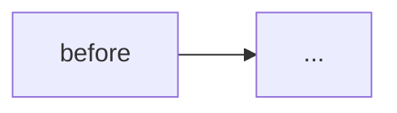

<!--
この template の意図は docs/architecture/harness.md の PR Discipline invariants を
満たすための構造チェック。埋められない欄がある場合は PR 単位を見直すか DRAFT のまま残す。

参考: https://zenn.dev/nttdata_tech/articles/8a010aff542625
(AI-native 開発で欠けやすい: テスト観点・PR 単位・仕様の明示・デグレ検出)
-->

## この PR merge 後に何が動くようになるか

<!--
1 文。ユーザー観察可能な動作で書く。「バケットが作られる」ではなく
「admin-console から tenant 作成するとメールが飛ぶ」のような、
end-user / operator が確認できる振る舞い。

「動く」= 商用運用に耐える状態。デモのためのハリボテ / 雑な MVP ではない。
小さい scope であっても、テストされていて意図が明確で、そのまま本番に出しても
壊れないレベルまで詰める。
(INVARIANT_PR_SHIPS_WORKING_INCREMENT)

書けない場合は PR 単位が適切でない。value を出す PR と束ねるか、rebase で順序を整えること。
-->

## なぜ今これが要るか

<!-- 2-3 文。無いと何に困るか、他の解との比較、優先度の根拠 -->

## 関連 Issue

<!--
GitHub の auto-close keyword (= `Closes #N` / `Fixes #N` / `Resolves #N`) を **括弧なし** で
書く。`(#N)` のように括弧で囲むと auto-close されない (= merge 後も Issue が開いたまま残る、
手動で close 漏れの原因)。複数 issue は別行に書く。

partial fix で issue を残したい場合は `Relates #N` (= auto-close されない) を使う。
全 close 不要な PR (refactor / docs / chore 等) はこのセクションごと削除可。
-->

- Closes #
- Relates #

## 変更前 → 変更後のフロー

<!--
mermaid で実行経路の差分。consumer を全部描く。
AWS リソース / event / API 呼び出しの順序を可視化する。
-->

## 物理影響

### AWS リソース (`make deploy`)

<!--
CFT 差分ベースで列挙する。「CFT 差分ゼロ」の場合も明示的に書く (reviewer に推論させない)。
種別: CREATE / UPDATE in-place / REPLACE (= 一時中断) / DELETE / NO-OP
-->

| Stack | Resource | 種別 | 影響 |
|---|---|---|---|
| _Stack_ | _Resource_ | _種別_ | _影響_ |

### ビルド成果物 (`make build`)

<!-- TS / static site / script など、deploy 外で変わる成果物 -->

| パッケージ | 変更 |
|---|---|
| _例: apps/admin-console_ | _ロジック変更のみ、AWS は不変_ |

## ファイルごとの変更意図

<!-- 全ファイル 1 行ずつ。「何を」ではなく「なぜ」を書く。触ったファイル数が 10 を超えたら PR 分割を検討 -->

- `path/to/file.ts` — _変更意図_

## Regression 分析

<!--
merge で壊しうる既存挙動を列挙する。未確認項目がある PR は DRAFT のまま残す
(INVARIANT_PR_REGRESSION_ANALYSIS_DOCUMENTED)。

確認方法は具体的に書く: grep / code read / test run / 実環境観察 など。
「テストが通った」だけでは Regression 分析にならない。テストが existing behavior を
カバーしているか自体を確認する必要がある。
-->

| # | 壊れうる既存挙動 | 影響範囲 | 確認状態 | 確認方法 / 対処 |
|---|---|---|---|---|
| 1 | _例: event consumer の契約_ | _例: `PROVISION_SUCCESS` 購読者_ | ✅ 確認済み / ❌ 未確認 | _grep で全 consumer を列挙: ..._ |

## Rollback 手順

<!-- この PR を revert したら何が起こるか、手順を書く。データ / サイドエフェクトの fate も明記 -->

1. `git revert <merge-sha>` → 新 PR で main に戻す
2. `make deploy` で CFT 差分を適用
3. _既に発生したデータ / サイドエフェクトの fate: ..._

## テスト戦略

<!--
この PR で touch したコードに対するテスト観点を宣言する。
既存テストがカバーする範囲 / 新規テストで追加した観点 / 未カバー観点を明示。

AI に丸投げで生成したテストは、実行パスを本当にカバーしているか必ず確認すること
(article の指摘: AI生成テストは claim した code path を実際に exercise していないケースがある)。
-->

- 既存テストでカバーされる観点 — _列挙_
- この PR で追加したテスト — _ファイル名 + 観点_
- 未カバー (受容する理由) — _例: 実環境でしか確認できない部分は `## Verification (merge 後)` に回した_

## Verification

### Merge 前 (DRAFT 解除条件)

- [ ] `make test`
- [ ] `make typecheck`
- [ ] `make lint`
- [ ] `make harness`
- [ ] `make synth` (対象 stack 全部)
- [ ] Regression 分析の未確認がゼロ
- [ ] merge で動くようになる機能を 1 文で書けている

### Merge 後 (deploy 後 signal)

- [ ] `make deploy` 成功
- [ ] _検証コマンド / 観察 signal_
- [ ] _tear-down で元に戻せるか (dev 環境)_

## 既知の未完了 (scope 外)

<!-- この PR で解決しない既知問題。scope から除外した理由、後続 issue / PR 案を明示 -->

- _項目 1_ — _後続 PR で対処予定 / 別 issue_
