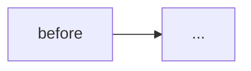

<!--
PR title: merged titles become the generated Release notes, so say what changed and where
(e.g. `fix(local-play): handle EPIPE from the simulator proxy`). Generic one-word titles
(update / fix / misc / 修正 / 更新 / 変更 ...) make meaningless release history — avoid them.
(The automated pr-title workflow that used to reject these at Issue #3024 AC11 was removed;
this is self-enforced now.)

This template is intended to satisfy the PR Discipline invariants enforced by .claude/harness by enforcing a consistent structure.
If a section cannot be completed, reconsider the PR scope or keep the PR in DRAFT.

Reference: https://zenn.dev/nttdata_tech/articles/8a010aff542625
(Common omissions in AI-native development: test coverage, PR boundary, specification clarity, regression analysis)
-->

## What will work after this PR is merged?

<!--
Write one sentence describing user-observable behavior. Do not describe implementation details like "a bucket is created." Instead write a behavior such as "creating a tenant from admin-console sends an email."

"Working" means production-ready behavior, not a demo or messy MVP.
Even a small scope must be tested, intentional, and safe to ship as-is.
(INVARIANT_PR_SHIPS_WORKING_INCREMENT)

If you cannot write this sentence, the PR scope is likely wrong. Bundle value-producing work together or reorder commits with a rebase.
-->

## Why is this needed now?

<!-- 2-3 sentences describing the problem, why it matters, and why this solution is appropriate. -->

## Related issues

<!--
Write GitHub auto-close keywords without parentheses: `Closes #N` / `Fixes #N` / `Resolves #N`.
Using `(#N)` prevents auto-close and may leave the issue open after merge.
Put each issue on its own line.

If this PR only partially resolves an issue, use `Relates #N`.
If no issue should be closed, remove this section.
-->

- Closes #
- Relates #

## Before → After flow

<!--
Use mermaid to show the change in execution flow. Include all consumers.
Visualize AWS resources, events, and API call order.
-->

## Physical impact

### AWS resources (`make deploy`)

<!--
List impacts based on CloudFormation diff. If there is zero CFT diff, state that explicitly.
Types: CREATE / UPDATE in-place / REPLACE (= interruption) / DELETE / NO-OP
-->

| Stack | Resource | Type | Impact |
|---|---|---|---|
| _Stack_ | _Resource_ | _Type_ | _Impact_ |

### Build artifacts (`make build`)

<!--
Mention any non-deploy artifacts that change: TS build output, static site, scripts, etc.
-->

| Package | Change |
|---|---|
| _e.g. apps/admin-console_ | _Logic change only; AWS remains unchanged_ |

## File-level intent

<!-- Write one line per file explaining why the change was made, not just what changed.
If more than 10 files are touched, consider splitting the PR. -->

- `path/to/file.ts` — _intent_

## Regression analysis

<!--
List existing behavior that this PR could break. Keep the PR in DRAFT if any items remain unchecked.
(INVARIANT_PR_REGRESSION_ANALYSIS_DOCUMENTED)

Be explicit about verification: grep, code review, test run, production observation, etc.
Passing tests alone is not enough; confirm that the tests actually cover the existing behavior.
-->

| # | Existing behavior at risk | Scope | Status | Verification / mitigation |
|---|---|---|---|---|
| 1 | _e.g. event consumer contract_ | _e.g. `PROVISION_SUCCESS` subscribers_ | ✅ Verified / ❌ Not verified | _list all consumers by grep: ..._ |

## Rollback procedure

<!-- Describe what happens if this PR is reverted and the steps to restore the previous state.
Include the fate of any data or side effects. -->

1. `git revert <merge-sha>` → open a new PR to restore main
2. `make deploy` to apply the CFT diff
3. _Data / side effect fate: ..._

## Test strategy

<!--
Declare the test coverage for the touched code.
State what existing tests cover, what new tests were added, and what remains untested.
AI-generated tests must still be manually validated against the actual code paths.
-->

- Covered by existing tests — _list scope_
- Added by this PR — _file names + coverage_
- Not covered (reason accepted) — _e.g. environment-only checks moved to `## Verification (after merge)`_

## Verification

### Before merge (DRAFT release criteria)

- [ ] `make test`
- [ ] `make typecheck`
- [ ] `make lint`
- [ ] `make harness`
- [ ] `make synth` (all target stacks)
- [ ] No unchecked regression analysis items
- [ ] One clear sentence describing the feature that will work after merge

### After merge (deploy signal)

- [ ] `make deploy` success
- [ ] _verification command / observation signal_
- [ ] _tear-down can restore the dev environment_

## Known incomplete work (out of scope)

<!-- Document known issues that this PR does not resolve, why they are excluded, and any follow-up issue or PR plans. -->

- _item 1_ — _planned for follow-up PR / separate issue_
