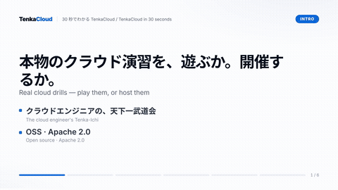
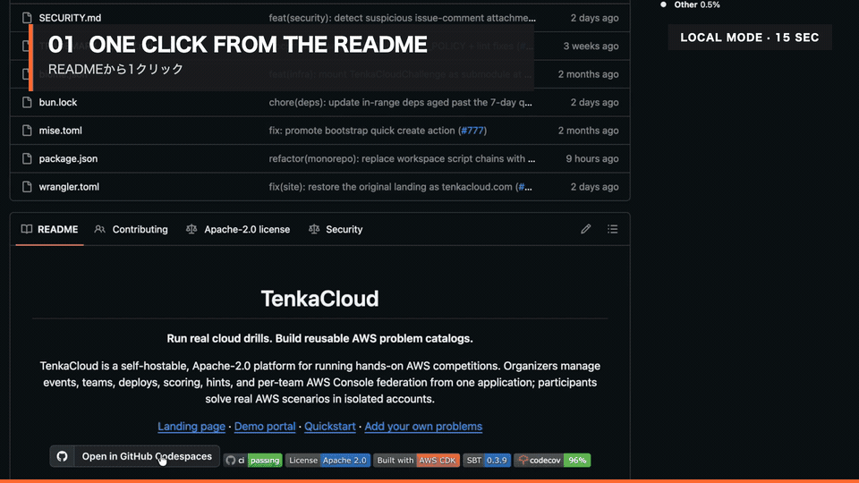

<!-- markdownlint-disable MD033 -->
<div align="center">

[English](./README.md) | **日本語**

# TenkaCloud

**本物のクラウドドリルを実行し、再利用できる AWS 問題カタログを育てる。**

TenkaCloud は、ハンズオン形式の AWS 競技会を運営するための、セルフホスト可能な Apache-2.0 ライセンスのプラットフォームです。運営者は 1 つのアプリケーションから、イベント・チーム・デプロイ・採点・ヒント・チームごとの AWS コンソール連携をまとめて管理でき、参加者は隔離されたアカウントの中で本物の AWS シナリオを解きます。

<table>
<tr>
<td width="50%" align="center" valign="top">

**A. まず遊ぶ** <sub>(推奨・AWS 不要・約 5 分)</sub>

[](https://codespaces.new/susumutomita/TenkaCloud)

</td>
<td width="50%" align="center" valign="top">

**B. 自分のイベントを開く** <sub>(AWS アカウント・課金あり・約 30 分)</sub>

[**AWS にデプロイする →**](#aws-にデプロイする)

</td>
</tr>
</table>

<a href="./landing/videos/lp/tenkacloud-30s.mp4">
  
</a>
<br>
<sub>30 秒でわかる TenkaCloud (音声なし・日英字幕): ブラウザで遊ぶ → 得点 → AWS で自分のイベントを開く。<a href="./landing/videos/lp/tenkacloud-30s.mp4">16:9 MP4</a> · <a href="./landing/videos/lp/tenkacloud-30s-vertical.mp4">9:16 MP4</a></sub>

[ランディングページ](https://tenkacloud.com) · [役割別マニュアル](https://tenkacloud.com/docs/manual/) · [デモポータル](https://tenkacloud.com/portal-demo/?demo=1) · [クイックスタート](#クイックスタート) · [自分の問題を追加する](#自分の問題を追加する)

[](https://github.com/susumutomita/TenkaCloud/actions/workflows/ci.yml)
[](https://codecov.io/gh/susumutomita/TenkaCloud)
[](./LICENSE)

<a href="https://www.producthunt.com/products/tenkacloud?embed=true&amp;utm_source=badge-featured&amp;utm_medium=badge&amp;utm_campaign=badge-tenkacloud" target="_blank" rel="noopener noreferrer"></a>

</div>

> TenkaCloud は独立したオープンソースプロジェクトであり、Amazon Web Services, Inc. と提携・承認・後援を受けたものではありません。AWS および関連する商標は Amazon.com, Inc. またはその関連会社の商標です。

英語版が正本であり、この日本語版は追従して更新されます。内容に差異がある場合は [README.md](./README.md) を優先してください。

---

## ビジョン

TenkaCloud は競技プラットフォームだけを目指しているわけではありません。プロダクトの方向性は、個人が安全に練習できる段階から、チームで競い合う段階へと進む一本道です。**ローカルドリル → 実践的なコース / エンタープライズ研修 → チーム対抗の競技 / GameDay → グローバルコミュニティ**。ローカルドリル(`make local`)は今日すでに動いています。コース、パッケージ化されたエンタープライズ研修、グローバルコミュニティは今後目指している方向であり、まだ実装済みの機能ではありません。

## TenkaCloud が提供するもの

TenkaCloud は、問題カタログをそのまま実際に動くクラウドドリルに変えます。

1. Application Admin Console で **イベントを作成** する。
2. カタログから **問題を選択** する。
3. **チームを登録** し、AWS アカウントの trust を設定する。
4. 各チームの隔離された AWS アカウントに **問題スタックをデプロイ** する(クロスアカウントの `AssumeRole` と、必須の `ExternalId` を使用)。
5. **イベントを実施** する — 参加者はポータルから、手順・ヒント・提出・スコア・ワンクリックの AWS コンソール連携を利用できる。

| スタイル | 用途 | 採点方式 |
| --- | --- | --- |
| **Challenge** | 個別演習形式の AWS タスクやラボ | flag / 解答の提出 |
| **Battle** | リアルタイムの運用ドリル | ヘルスプローブ、フェーズ型ポーリング、攻撃検知など、カタログが宣言する採点方式 |

## クイックスタート

### ブラウザで試す(GitHub Codespaces、インストール不要)

Codespaces でプレイできるのは **クラウド非依存のドリルのみ** です — AWS アカウントを必要としない、自己完結した Docker コンテナ問題です。自分の AWS アカウントにデプロイする AWS 問題は Codespaces では遊べません。そちらは下の「AWS にデプロイする」を参照してください。

<div align="center">
  <a href="./docs/assets/codespaces-local-mode/codespaces-local-mode-readme-1280x720.mp4">
    
  </a>
  <br>
  <sub>日英 2 言語で 15 秒: Codespaces → <code>make local</code> → ドリル起動 → ローカル採点。</sub>
</div>

[](https://codespaces.new/susumutomita/TenkaCloud)

1. 上のバッジをクリックして **Create codespace on main** を選ぶ(最初のビルドで Bun のインストール、`problems/` の初期化、Docker の起動まで自動で行われる)。
2. コンテナの起動が終わるまで待つ。ローカルプレイは自動で起動し、**Participant Portal も自動でプレビュータブに開く** — 何も入力する必要はない。
3. 自動でプレビューが開かなかった場合は、**PORTS** タブを開き、ポート **5175** の横にあるプレビュー用のアイコンをクリックする。

> Codespaces の中にとどまってください。ドリルへのリンクはポート `5175` のプレビュー URL 経由で解決されます。自分の PC のブラウザタブに生の `127.0.0.1` の URL を貼り付けても、自分の PC 自体を指すだけで動作しません。
>
> **任意の手動再実行:** 自動起動には 4 分の待機ウィンドウがあります(コンテナイメージはセットアップ時にあらかじめビルド済みのため、通常は高速です)。タイムアウトした場合(Codespaces の起動ログにその旨が表示されます)は、**「▷ ローカルプレイ開始」** タスクを自分で実行してください(コマンドパレット → **Tasks: Run Task**、または `Cmd/Ctrl+Shift+B`)— これが代わりに `make local` を実行してくれる。

### ローカルで試す(AWS 不要)

`make local` が参加者向けの主入口です。ローカル採点 API と Participant Portal を Docker コンテナ内で起動し、開いた画面からドリルを選べます。進捗は Docker が管理する volume に保存され、DynamoDB と AWS SDK には依存しません。

**前提条件は Git・Make・Docker Engine・Docker Compose v2 のみです。Bun・Node・`node_modules` はホストに不要です。** `make doctor` は、この参加者向け Docker-only 経路の起動前要件を Bun なしで診断し、何もインストールしません。実コンテナ起動後、`curl` または `wget` があれば `make local` が Portal のホスト到達性を検証します。どちらもなければ起動自体は成功しますが、到達性を未検証と明示し、表示した URL を開いて確認するよう案内します。`PROFILE=recommended` を付けると、Docker の CPU・メモリ・任意のディスク割り当てを公開済みの[動作要件プロファイル](./docs/local-play-requirements.md)と比較できます。

```bash
git clone --recurse-submodules https://github.com/susumutomita/TenkaCloud.git
cd TenkaCloud
make local
```

`make local` は Docker のインストールと起動状態を確認し、`problems/` submodule が未取得なら取得を提案し、local-play コンテナを build・起動して、準備ができたら Portal の URL を表示します。`make local-down` で停止して進捗を消去、`make local-status` で起動状況を確認できます。

> **Docker Desktop (macOS/Windows) を使う場合:** local-play コンテナは host networking で動作します。Docker Desktop では初回だけ **設定 → Resources → Network → Enable host networking**(Desktop 4.34 以降)を有効化してください。`curl` または `wget` があれば、コンテナが正常でもホストから到達できない場合に `make local` はこの手順そのものを表示して失敗します。どちらの検証コマンドもなければ到達性を未検証と報告して成功するため、表示した URL を開いて手動確認してください。ネイティブの Linux Docker Engine と Codespaces ではこの設定は不要です。

<details>
<summary>開発者向け: Bun / Vite のホットリロード経路</summary>

`make local-dev` は同じ local-play スタックを Docker を使わずホスト上で Bun / Vite で直接実行します(変更のたびにコンテナを再ビルドせずホットリロードできます)。

```bash
git clone --recurse-submodules https://github.com/susumutomita/TenkaCloud.git
cd TenkaCloud
make local-onboard
make local-dev
```

`make doctor-dev` は、この開発者向け経路の report-only 診断です。Bun を必要とし、mise の trust、`problems/` submodule、Bun、Docker Compose、Docker daemon を確認します。`make local-onboard` は、開発者向け前提条件の修復を提案し、インストール前に必ず同意を求めます。無人実行では `make local-onboard YES=1` ですべてのインストールを事前承認できます。

さらに低レベルには `make install && git submodule update --init problems && bun link && tenkacloud local`(`bun link` を行わない場合は `bun run tenkacloud local`)でも実行できます。ドリル一覧は `tenkacloud local list`、1 つを事前起動する場合は `tenkacloud local --problem <id>` です。リモート保存を使う場合だけ `--database turso` と `TENKACLOUD_LOCAL_TURSO_URL` / `TENKACLOUD_LOCAL_TURSO_AUTH_TOKEN` を明示します。デフォルトは常に SQLite です。

</details>

全サブコマンドとコンテナ/ホスト境界は [docs/local-play.md](./docs/local-play.md)(英語)を参照してください。

### AWS にデプロイする

AWS コンソールからデプロイします。CloudFormation スタックが CodeBuild プロジェクトを作成し、このリポジトリを Git clone してデプロイまで代行してくれます。**ローカルへのインストールも GitHub 連携も不要です**。

launcher の repository 初期値は、最後に公開した release baseline の platform / catalog の
immutable な組み合わせです。作業中の [`release manifest`](./release/tenkacloud-release.json) は
次の release を記述し、その platform commit は `v*` タグから publish 時に導出します。
[`自動生成 release report`](./release/tenkacloud-release.md) が示す launcher 初期値の現在の区分は
**candidate / unverified** です。`main` の移動による内容変更は防ぎますが、Golden Path の証拠が
無い状態を認定済みとは扱いません。launcher stack のどちらかの ref parameter を `main` にした
場合は、Output と build log に **development / unreleased** と表示します。CodeBuild でその 1 回
だけ環境変数を override した場合、実際の選択は build log に表示されますが、CloudFormation
Output は stack に保存された parameter の区分を示し続けます。

> **設計意図: イベント単位の一時環境。** デフォルトのライフサイクルは「1 イベント用に launcher を作り、デプロイし、イベントを実施し、撤去する」であり、自動で更新され続ける常設 SaaS ではありません。イベントの合間も稼働させたままで構いませんが、以下の手順(撤去を含む)はすべてイベント単位の運用を前提に書いています。launcher・build・destroy の責務分担とパラメータ別の再ビルド方針は [`infrastructure/templates/README.md`](./infrastructure/templates/README.md#cloudformation-console-lite-mode-deployment-pipeline)、当日の運用フローは [`docs/operations/event-runbook.md`](./docs/operations/event-runbook.md) を参照してください。

1. [`infrastructure/templates/lite-pipeline.yaml`](./infrastructure/templates/lite-pipeline.yaml) をダウンロードする。
2. `ap-northeast-1` の [CloudFormation のスタック作成ページ](https://console.aws.amazon.com/cloudformation/home?region=ap-northeast-1#/stacks/create/template) を開き、**Upload a template file** でアップロード、スタック名は **`tenkacloud-lite-launcher`** とする。
3. パラメータグループ **Required** の **`TenantAdminEmail`** に、Admin Console のログイン用メールアドレスを設定する。ほかのグループには初期値が入っており、repository の初期値は上記 release report の immutable candidate である。(自分の問題カタログを使いたい場合は **Advanced: repository sources** グループの `ProblemsRepoUrl` も設定してください — [自分の問題を追加する](#自分の問題を追加する) を参照。)
4. **acknowledge IAM** にチェックし、スタックを作成する(ビルド用の CodeBuild ロールが全スタックをデプロイできる強い権限を必要とするため、コンソールにその理由が表示される)。
5. スタックの **`StartBuildConsoleUrl`** 出力から CodeBuild プロジェクトを開き、**Start build** を押す。

上に one-click の *Launch Stack* バッジを置いていないのは意図的な判断です。CloudFormation の `templateURL` は Amazon S3 URL にしか対応しておらず、GitHub raw URL をそのまま渡すと `TemplateURL must be a supported URL` で失敗します。**Upload a template file**(手順 2)が、自前で S3 バケットを持たない self-host OSS プロジェクトにおける one-click 相当の正式な手順です。

**`Start build` を手動のままにしている理由:** launcher スタックを作るだけではデプロイは自動開始しません。これは片付け忘れの手作業ではなく意図的な設計です — 課金の発生する操作を明示的なスイッチの先に置き、`RepoRef` / `ProblemsRepoRef` / capacity を確認してから実行できる確認点を作り、launcher への意図しない CloudFormation スタック更新が黙って再デプロイを引き起こさないようにしています。**Start build** は、イベント環境を起動するスイッチだと捉えてください。

15〜30 分ほどでビルドが完了します。すでに見ている CodeBuild のビルドログを一番下までスクロールしてください — デプロイの最後に `✓ Lite mode deploy complete` ブロックが出力され、その **Access URLs:** セクションに **Application Admin Console** と **Participant Portal** の URL がそのまま載っており、続けて **Next steps:** と **Teardown:** の案内も表示されます。CloudFormation 側で確認したい場合は、同じ 2 つの URL がビルドが作成する `tenkacloud-lite` / `tenkacloud-lite-problem-deploy` 各スタックの **Outputs** にも載っています。

**完全削除する場合:** 同じ CodeBuild プロジェクトで **Start build with overrides** を選び、環境変数 `ACTION` に `destroy-all` を設定して実行してください。Lite の 2 スタックに加え、明示的に保持した DynamoDB テーブルと問題デプロイ用ログも削除されます。その後 `tenkacloud-lite-launcher` スタック自体を削除すると、CodeBuild プロジェクト、IAM Role、launcher のログも消えます。通常の `ACTION=destroy` でも DynamoDB テーブルはデフォルトで削除されます。履歴を残す場合は、デプロイ時に `RetainDataTables=true` を指定してください。

`destroy-all` 追加前に作成した launcher は、先に CloudFormation のスタック更新で最新版の `lite-pipeline.yaml` を適用してください。旧 buildspec は未知の ACTION を deploy として扱うため、旧 launcher に `destroy-all` を直接指定してはいけません。

同じ launcher を次のイベントでも再利用すること自体は可能です(ビルドのたびに両方の repo を re-clone するため)。ただし推奨する運用は、イベントごとに launcher を作り直すことです。初期値は manifest の完全な commit SHA に固定済みです。より新しい `main` または branch をリハーサルする場合は、通過した platform / catalog の完全な commit SHA を記録し、本番ではその 2 値を使ってください。撤去後は launcher も削除します。パラメータ別の再ビルド表とリハーサルから本番までの流れは [`infrastructure/templates/README.md`](./infrastructure/templates/README.md#cloudformation-console-lite-mode-deployment-pipeline) と [`docs/operations/event-runbook.md`](./docs/operations/event-runbook.md) を参照してください。

## 対応環境

- **macOS・Linux・WSL2** — 参加者向け Docker-only ローカルプレイ(`make local`)、開発者向け Bun / Vite ローカルプレイ(`make local-dev` / `tenkacloud local`)、AWS デプロイ(`make deploy` の Lite mode、`make deploy-saas` の SaaS mode)に対応する。
- **WSL2 を使わないネイティブ Windows** — ローカルプレイは非対応。上記の GitHub Codespaces を使うか、先に WSL2 を導入する。
- **ブラウザのみでローカルインストール不要な場合** — 上記の GitHub Codespaces を使う。

**必要なマシンスペック**は同時に起動する問題数で変わるため、`minimum` / `recommended` / `full` の 3 プロファイルとして実測値付きで公開しています。[docs/local-play-requirements.md](./docs/local-play-requirements.md) を参照してください。手元のマシンとの比較には、Bun 不要の参加者向け診断 `make doctor PROFILE=recommended` を使います。

## 運用コスト

TenkaCloud は `CDK_PARAM_CONTROL_DATA_BACKEND` 環境変数で選べる 2 つのプロファイルのいずれかで動きます(未設定の場合はデフォルト)。

| プロファイル | 向いている人 | 制御データ | 問題デプロイ |
| --- | --- | --- | --- |
| **AWS ネイティブ**(デフォルト、未設定 または `dynamodb`) | すべてを AWS 内で完結させたいチーム / 企業 | DynamoDB(プロビジョンド 1/1)、8 テーブル + 8 GSI | Lambda の `CreateStack`(デフォルト) |
| **ゼロコスト**(オプトイン、`turso`) | 個人利用・トライアル・個人イベント | Turso(libSQL)— Lite synth で DynamoDB テーブル / GSI ともに 0 個 | Lambda の `CreateStack`(デフォルト) |

ゼロコストプロファイルの初回ライブ検証は、まず `make turso-live ENV=development` を実行してください。対話 wizard が Turso CLI / login、DB、SSM SecureString、`.env` の公開設定、read-only preflight、`deploy` の完全一致確認、CloudFormation 上の DynamoDB 0 件確認までを一続きで進めます。token は画面・argv・`.env` に出さず、標準入力から SSM へ渡します。同じ機能を直接実行する場合は `ENV=development bun run tenkacloud turso-live`、`bun link` 後は `ENV=development tenkacloud turso-live` を使えます。その後の画面操作と現時点でのライブ検証状況は [docs/running-costs.md](./docs/running-costs.md) にあります。

## 自分の問題を追加する

このプラットフォーム自体を fork する必要は一切ありません。問題を共有したいかどうかによって、2 つの経路があります。

- **公式カタログに貢献する** — 広くコミュニティで再利用してほしい問題向け。
- **非公開の Problem Pack を追加する** — 社内限定や一度きりのイベント用で、自分のマシンやテナントの外に出す必要がない問題向け。

### オプション A: 公式カタログに貢献する

問題は専用のリポジトリ — [TenkaCloudChallenge][catalog] — に置かれ、デプロイ時に clone されます。

1. [TenkaCloudChallenge][catalog] を **fork** する。
2. 付属ツールで **問題を作成・検証** する — `scripts/new-problem.ts` が問題の雛形を生成し、スキーマとバリデータが出荷前にチェックしてくれる。
3. **自分のカタログをデプロイ** する — [クイックスタート](#クイックスタート) の手順を、`ProblemsRepoUrl` に自分の fork を設定した状態で実行する。それ以外は何も変わらない。

問題ディレクトリは 3 つのファイルで構成されます。`metadata.json`(カタログ表示 + 採点ルール + ポータルのスロット配線)、`template.yaml`(チームの隔離された AWS アカウントにデプロイされる CloudFormation)、そして任意の `portal/`(Participant Portal 用の React コンポーネント)です。

### オプション B: 非公開の Problem Pack を追加する

**Problem Pack**(Issue #2088)は、カタログリポジトリに公開することなく、単一テナント向けにインストール・有効化できる、オフラインで検証済みの問題バンドルです。社内限定のドリルや一度きりのイベント用問題に向いています。`pack` CLI はすべてローカルで完結し、クラウド呼び出しは発生しません。固定コミットから install する場合を除き、ネットワーク通信も発生しません。

```bash
make pack-init ARGS="./my-pack --runtime aws/cloudformation"        # scaffold a pack
make pack-validate ARGS="./my-pack"                                  # check manifest + template
make pack-install ARGS="./my-pack"                                   # snapshot + lock it
make pack-activate ARGS="com.example.starter@0.1.0 --tenant local"   # activate for one tenant
# then create the event in the Application Admin Console — the activated
# pack's problems appear in the catalog picker there
```

`local` は Lite mode の固定テナント id で、`make deploy` が synth 時に読み取る値です。実際に Lite mode でデプロイするのが目的なら、任意の名前ではなくこのテナント id に対して activate してください。この一連の流れは Lite mode に限定されており、SaaS mode(`make deploy-saas`)は pack の activation が 1 つでも存在すると、それを黙って pooled カタログから外すのではなく synth 自体を拒否します。

詳細: [コンセプト](./apps/developer-portal/src/app/developers/docs/concepts/problem-packs/page.mdx) · [チュートリアル](./apps/developer-portal/src/app/developers/docs/tutorials/first-pack/page.mdx) · [マニフェストリファレンス](./apps/developer-portal/src/app/developers/docs/reference/pack-manifest/page.mdx) · [固定コミットからの install](./infrastructure/lib/problem-pack/README-external-git-pack.md)(いずれも英語)。developer portal 自体はまだデプロイされていないため、上記リンクはリポジトリ内の MDX ソースを直接指しています。一方で上記の `make pack-*` コマンドはすべて今日から使える、実際に動く CLI です。

Problem Pack の一連の流れ(`pack-init` から `pack-install`(ローカルパス)、`pack-activate --tenant local`、実 AWS への Lite mode デプロイ、Application Admin Console のカタログ表示、参加者による flag 提出・採点まで)は、end-to-end で live 検証済みです。

[catalog]: https://github.com/susumutomita/TenkaCloudChallenge

## エンタープライズ / 社内研修

TenkaCloud をエンタープライズや社内研修の用途 — ハンズオン形式のセキュリティ・運用ドリル、評価・オンボーディング演習、カスタム/非公開の問題セット、講師付きワークショップなど — で検討されている場合は、[お問い合わせフォーム](https://forms.gle/djVprYmq3hFgJA7P9) または [GitHub Discussions](https://github.com/susumutomita/TenkaCloud/discussions) からお気軽にご連絡ください。TenkaCloud はオープンソースとして公開していますが、実際の現場で求められる研修ニーズや、カスタム演習の要件についてもっと知りたいと考えています。

## 書籍

**[『自分で作るクラウド競技』](https://zenn.dev/bull/books/cloud-competition)** — TenkaCloud の設計思想と、クラウド競技基盤をゼロから
作る過程を解説しています。English: **[Build Your Own Cloud Competition](https://leanpub.com/build-your-own-cloud-competition)**。

書籍はプラットフォームが今の形になった理由を扱い、現行挙動の正本はこのリポジトリの実装とテストです。
両者が食い違う場合はリポジトリが正しく、書籍は判断の記録であって API リファレンスではありません。

## ドキュメント

- [DEPLOYMENT_GUIDE.md](./DEPLOYMENT_GUIDE.md)(英語)— ローカル端末からのデプロイと SaaS mode
- [docs/local-play.md](./docs/local-play.md)(英語)— ローカルドリルの内部実装、コンテナ問題の作り方、`/verify` の契約
- [docs/running-costs.md](./docs/running-costs.md)(英語)— 2 つのコストプロファイル、ゼロコストへのオプトイン手順、実測コスト
- [docs/architecture/README.md](./docs/architecture/README.md)(英語)— architecture 原則と機械強制される境界

## コントリビューション

1. [CONTRIBUTING.md](./CONTRIBUTING.md) と [AGENTS.md](./AGENTS.md) を読む(いずれも英語)。
2. インフラ / テンプレートの変更と、アプリケーションコードの変更は分けて PR にする。
3. PR を開く前に `make harness` と `make before-commit` を実行する。

## ライセンス

[Apache License 2.0](./LICENSE) — 商用利用、改変、再配布が可能です。
