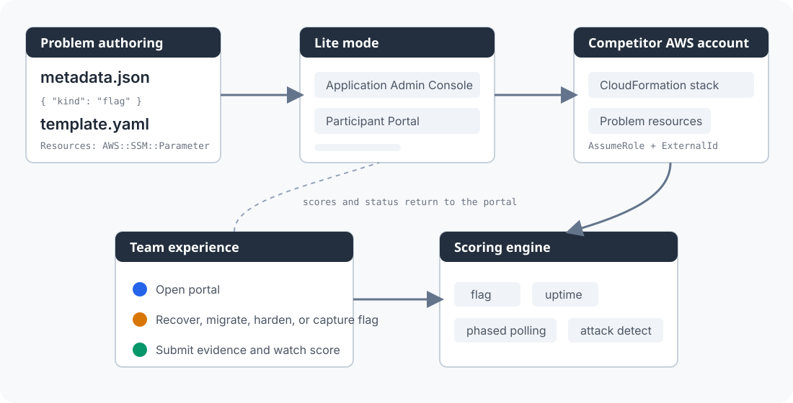

<!-- markdownlint-disable MD033 -->
<div align="center">

# TenkaCloud

**Run real cloud drills. Build reusable problem catalogs.**

TenkaCloud is an OSS platform for running real cloud drills: teams solve hands-on
cloud problems in isolated AWS environments, while organizers manage events, scoring,
and reusable problem catalogs from a single console.

[Landing page](https://susumutomita.github.io/TenkaCloud/) · [Play the mock](https://susumutomita.github.io/TenkaCloud/portal-demo/?demo=1) · [Quickstart](#quickstart-lite-mode) · [Problem catalog](#problem-catalog) · [Architecture](#architecture)

[](https://github.com/susumutomita/TenkaCloud/actions/workflows/ci.yml)
[](./LICENSE)
[](https://aws.amazon.com/cdk/)
[](https://github.com/awslabs/sbt-aws)
[](https://codecov.io/gh/susumutomita/TenkaCloud)

</div>

> TenkaCloud is an independent open-source project and is not affiliated with, endorsed by, or sponsored by Amazon Web Services, Inc. AWS and related marks are trademarks of Amazon.com, Inc. or its affiliates.

---

## What is TenkaCloud

A self-hostable, OSS competition platform that turns hands-on AWS scenarios into a
running event in about 30 minutes. Each team gets an isolated AWS environment
provisioned via cross-account `AssumeRole` + `ExternalId`. Problems are plain files
(`metadata.json` + `template.yaml`) versioned in a sibling catalog repo, so anything
you write once becomes a reusable training asset.

Two delivery modes share the same platform:

- **Battle** — real-time uptime drills. A health probe hits every team every minute;
  the last team standing wins.
- **Challenge** — self-paced problems with flag submissions. Learn one AWS service at
  a time, in depth.

> [image needed: hero screenshot of the Application Admin Console event page]
> Place a screenshot at `docs/assets/screenshots/admin-console-event.png` and replace
> this placeholder. Suggested capture: an active event with two teams, the Problems
> tab open, deploy status visible.

## Who is it for

Four audiences shape the product. If you recognize yourself below, TenkaCloud is for
you.

| Audience | What you get |
| --- | --- |
| **CCoE leads** running an org-wide cloud enablement program | A repeatable event runtime — new-grad onboarding, internalization drills, cross-team competitions — without re-building the platform every quarter. |
| **Cloud communities, meetups, and schools** | A free, self-hostable competition stack on your own AWS account. No SaaS fees, no per-seat pricing, no participant data leaving your account. |
| **Facilitators and event organizers** | One screen for deploy, scoring, leaderboard, and per-team Console federation. A week of setup collapses to an afternoon. |
| **Platform / SRE engineers** | A plugin model where a problem is two files plus an optional portal React component. The platform is the host; problems are the plugins (ADR-012). |

## Quickstart (Lite mode)

Lite mode is the fastest path: one organizer, one event, one AWS account. It skips
the SBT control plane entirely and stands up just the Application Admin Console, the
Participant Portal, and the deploy backend. From `git clone` to a first running event
takes roughly 30 minutes — most of that time is `cdk deploy` waiting on AWS.

### Option A — one-click deploy (CloudFormation)

Don't want to install anything locally? Launch a self-contained deployment pipeline
straight into your AWS account:

[](https://console.aws.amazon.com/cloudformation/home?region=ap-northeast-1#/stacks/quickcreate?templateURL=https://tenkacloud-launch-ACCOUNT_ID-ap-northeast-1.s3.ap-northeast-1.amazonaws.com/lite-pipeline.yaml&stackName=tenkacloud-lite-pipeline)

The stack ([`infrastructure/templates/lite-pipeline.yaml`](./infrastructure/templates/lite-pipeline.yaml))
is a standalone single-file template — independent of the CDK app. It stands up a
CodePipeline (`Source → optional Manual Approval → Build`) that clones the repo and
runs `make deploy` (Lite mode) on CodeBuild. The one manual prerequisite is a
**GitHub CodeStar Connection** (AWS Console → Developer Tools → Connections); paste
its ARN and your admin email as stack parameters. Full walkthrough:
[`infrastructure/templates/README.md`](./infrastructure/templates/README.md#one-click-lite-mode-deployment-pipeline).

> **Maintainers:** CloudFormation only loads templates from Amazon S3 (a
> `raw.githubusercontent.com` URL is rejected with `TemplateURL must be a
> supported URL`), so the button points at an S3 mirror of `lite-pipeline.yaml`.
> Publish it and rewrite the button URL above in one step —
> `make publish-launch-template ARGS="--write-readme"` — then commit the change.
>
> No AWS CLI handy? Download
> [`lite-pipeline.yaml`](./infrastructure/templates/lite-pipeline.yaml) and use
> CloudFormation's **Upload a template file** instead — no S3 needed.

### Option B — from your terminal

```bash
git clone --recurse-submodules https://github.com/susumutomita/TenkaCloud.git
cd TenkaCloud
make install

cp infrastructure/environments/development/.env.example \
   infrastructure/environments/development/.env
# edit AWS_ACCOUNT_ID and TENANT_ADMIN_EMAIL

make deploy
```

When the deploy finishes you get:

- **Application Admin Console** — pick problems, kick off deploys, watch progress.
- **Participant Portal** — team login, problem details, hints, submissions, scores.
- **Problem deploy backend** — DynamoDB + Lambda + Step Functions + CodeBuild.

Teardown is a single command: `make destroy`.

> [image needed: participant portal Quests page]
> Place a screenshot at `docs/assets/screenshots/participant-portal-quests.png`
> showing the deployed problem list with status badges and difficulty.

## Problem catalog

Problems live in a separate repo: [susumutomita/TenkaCloudChallenge](https://github.com/susumutomita/TenkaCloudChallenge).
It is mounted here as a git submodule under `problems/`, so `make deploy` ships
whichever catalog version the submodule currently points at.

Five problems ship today (see the catalog repo's [CATALOG.md](https://github.com/susumutomita/TenkaCloudChallenge/blob/main/CATALOG.md) for the source of truth):

| Problem | Mode | Difficulty | One-line summary |
| --- | --- | --- | --- |
| `hello-world` | Challenge | Intro | Read a greeting out of SSM Parameter Store and submit it as a flag. The hello-world for the platform itself. |
| `hello-world-battle` | Battle | Intro | Keep an EC2-hosted nginx frontend + Python API both returning 200 every minute to score uptime. |
| `microservice-migration-battle` | Battle | Advanced | Split a 3-service EC2 monolith into Lambda + ECS Fargate + App Runner under a phased polling clock. |
| `security-battle-royale` | Battle | Advanced | Keep a fictional e-commerce site (`Tenryu.Mart`) returning 200 while under live attack. Availability over polish. |
| `stackstack` | Battle | Advanced | Production-harden AI-generated scaffolds across 5 axes (auth / network / rate / audit / ux). Managed-runtime cutover multiplies the score 10x. |

> [image needed: catalog screenshot]
> Place a screenshot at `docs/assets/screenshots/problem-catalog.png` showing the
> Application Admin Console Problems tab with the five entries above.

A high-level walkthrough of each problem also lives in the [Competition Gallery](./docs/gallery.md).

## Architecture

TenkaCloud is a multi-plane CDK app: a Control Plane (SBT-based tenant manager), an
Application Plane (Tenant Admin Console + Participant Portal), and a Problem Deploy
backend that AssumeRoles into each competitor's isolated AWS account via a per-team
`ExternalId`. Problems are plugins (ADR-012); the platform is the host.



Two operating modes share the same code:

| Mode | Use it when | Entry point |
| --- | --- | --- |
| **Lite** | One organizer, one event, one AWS account | `make deploy` |
| **SaaS** | Multi-tenant control plane with a per-tenant provisioning pipeline | `make deploy-saas` |

Start with these architecture docs:

- [`docs/architecture/OVERVIEW.md`](./docs/architecture/OVERVIEW.md) — full architectural narrative
- [`CONTRIBUTOR_MAP.md`](./CONTRIBUTOR_MAP.md) — "I want to do X" navigation
- [`docs/architecture/MODULE_MAP.md`](./docs/architecture/MODULE_MAP.md) — "where is X" directory map
- [`docs/architecture/GLOSSARY.md`](./docs/architecture/GLOSSARY.md) — term definitions with ADR back-links

Decision rationales (ADRs):

- [ADR-012: Problem plugin architecture](./docs/architecture/adr-012-problem-plugin-architecture.html)
- [ADR-016: TenkaCloud Lite mode](./docs/architecture/adr-016-tenkacloud-lite-app-plane-core.html)
- [ADR-017: Cloud Action Intent / Trust Bridge](./docs/architecture/adr-017-cloud-action-intent-trust-bridge.html)

## Self-host vs operated

The platform itself is Apache 2.0 — **self-hosting on your own AWS account is free**.
Three optional paid plans exist for organizations that want setup, day-of operations,
or a recurring program run for them: **Starter** (one pilot event), **Hosted Event**
(a single operated event), and **Annual Arena** (an annual program with multiple
events per year). Details on the [landing page](https://susumutomita.github.io/TenkaCloud/#pricing).

### Commercial

Four productized offerings are documented in
[`docs/commercial/PACKAGES.html`](./docs/commercial/PACKAGES.html):

- **Hosted Event** — a 1-3 day operated drill on the public OSS catalog (setup → live → report).
- **Annual Arena** — a 12-month program with 4-6 operated events, a private problem catalog, and an HR / training KPI dashboard.
- **Custom Problem** — a single problem authored to a buyer's stack or past incident, delivered as a self-contained problem directory (sanitized scenario; never production access).
- **CCoE Enablement** — advisory retainer for operating-model work, sold separately so events stay productized.

The OSS path stays free. Paid offerings fund facilitation, custom problems, and program-level support. See the [Sales Playbook](./docs/commercial/SALES-PLAYBOOK.html) for per-package elevator pitches, qualifying questions, and common objections.

## Create your first problem

Problem authoring happens in the catalog repo, not here. A problem is a self-contained directory under `battles/<id>/` or `challenges/<id>/` in that repo:

```text
metadata.json    # catalog display + scoring rule + portal slot wiring
template.yaml    # CloudFormation deployed to the team's isolated AWS environment
portal/          # optional React components for the Participant Portal
services/        # optional in-stack code (docker-compose / Lambda payload / etc)
```

The scaffolding CLI is still hosted in this platform repo because it depends on shared TypeScript packages:

```bash
bun run scripts/tenkacloud-problem.ts create my-first-challenge --kind flag
bun run scripts/tenkacloud-problem.ts validate my-first-challenge
```

Move the generated directory into your local clone of the catalog repo, open a PR there, and a platform-side maintainer bumps the submodule pointer once it merges.

Authoring references:

- [30-minute problem authoring guide](./docs/problems/AUTHORING.html) — platform-side authoring narrative
- [Problem schema (`SCHEMA.json`)](https://github.com/susumutomita/TenkaCloudChallenge/blob/main/SCHEMA.json) — catalog repo, source of truth
- [Catalog repo README](https://github.com/susumutomita/TenkaCloudChallenge#readme) — contributor flow on the catalog side

## Full deployment (SaaS mode)

Use SaaS mode when you want tenant onboarding, pooled/silo tiers, and the full SBT
control plane:

```bash
cp infrastructure/environments/development/.env.example \
   infrastructure/environments/development/.env
# edit SYSTEM_ADMIN_EMAIL, AWS_ACCOUNT_ID, and AWS_REGION

make deploy-saas
```

The repository also includes targeted commands for local development:

```bash
make lite-status
make lite-console-url
make lite-portal-url
make before-commit
make harness
```

## Contributing

Contributor path:

- Read [CONTRIBUTING.md](./CONTRIBUTING.md).
- Pick a starter task from [ROADMAP.md](./ROADMAP.md#good-first-issue-candidates).
- Run `make before-commit` and `make harness` before opening a PR.

AI agent guidelines: [AGENTS.md](./AGENTS.md) · [CLAUDE.md](./CLAUDE.md)

## License

[Apache License 2.0](./LICENSE) — use commercially, modify, and distribute.
