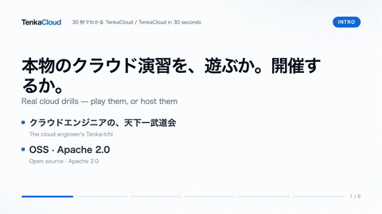
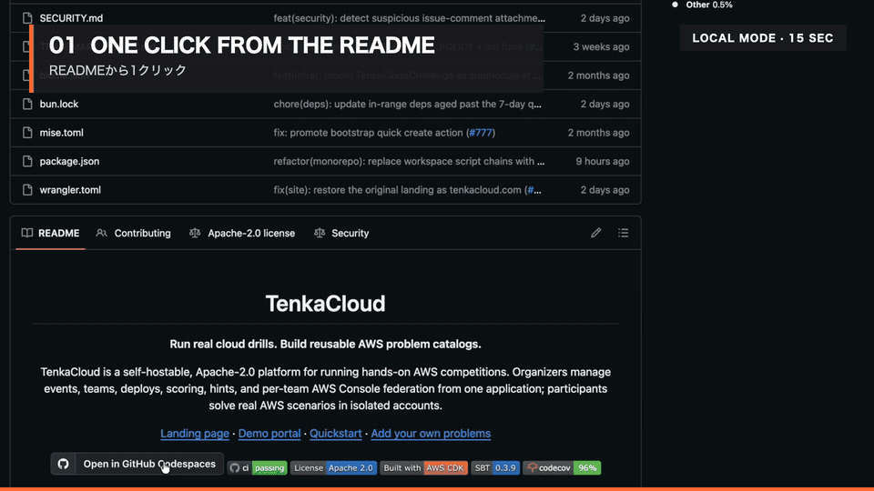

<!-- markdownlint-disable MD033 -->
<div align="center">

**English** | [日本語](./README.ja.md)

# TenkaCloud

**Run cloud competitions. Build reusable problem catalogs.**

TenkaCloud is a self-hostable, Apache-2.0 platform for hands-on cloud competitions. Organizers manage events, teams, problem environments, scoring and hints from one console. Participants solve local exercises or AWS scenarios with their own team keys.

<table>
<tr>
<td width="50%" align="center" valign="top">

**A. Try a local competition** <sub>(no AWS account needed)</sub>

[](https://codespaces.new/susumutomita/TenkaCloud)

</td>
<td width="50%" align="center" valign="top">

**B. Host on AWS** <sub>(AWS account, usage charges apply)</sub>

[**Deploy on AWS →**](#deploy-on-aws)

</td>
</tr>
</table>

<a href="./landing/videos/lp/tenkacloud-30s.mp4">
  
</a>
<br>
<sub>30-second product overview (silent, bilingual captions). Follow the current setup steps below. <a href="./landing/videos/lp/tenkacloud-30s.mp4">16:9 MP4</a> · <a href="./landing/videos/lp/tenkacloud-30s-vertical.mp4">9:16 MP4</a></sub>

[Landing page](https://tenkacloud.com) · [Manuals by role](https://tenkacloud.com/docs/manual/index.en.html) · [Demo portal](https://tenkacloud.com/portal-demo/?demo=1) · [Quickstart](#quickstart) · [Add your own problems](#add-your-own-problems)

[](https://github.com/susumutomita/TenkaCloud/actions/workflows/ci.yml)
[](https://codecov.io/gh/susumutomita/TenkaCloud)
[](./LICENSE)

<a href="https://www.producthunt.com/products/tenkacloud?embed=true&amp;utm_source=badge-featured&amp;utm_medium=badge&amp;utm_campaign=badge-tenkacloud" target="_blank" rel="noopener noreferrer"></a>

</div>

> TenkaCloud is an independent open-source project and is not affiliated with, endorsed by, or sponsored by Amazon Web Services, Inc. AWS and related marks are trademarks of Amazon.com, Inc. or its affiliates.

---

## Quickstart

Invited to an event? Use the **Participant Portal URL and team key from your organizer**. You do not need to install or deploy TenkaCloud.

### Try it locally (no AWS)

Install Git, Make and **Bun 1.3.11** on macOS, Linux or WSL2. Docker Engine with Compose v2 is needed for Docker exercises; the built-in Cryptography Battle needs neither Docker nor AWS. [mise.toml](./mise.toml) pins the development tools.

```bash
git clone --recurse-submodules https://github.com/susumutomita/TenkaCloud.git
cd TenkaCloud
make install
make local
```

1. Open the printed organizer URL and sign in with the **organizer key** shown once in your terminal. No username or password is needed.
2. Create an event, add teams and select problems. Prepare their environments, then start the event.
3. Give each team its own participant URL and key. For Docker exercises, participants choose **Start / resume** when ready.
4. Solve a problem, submit the answer it requests and check the score.

**Lost the organizer key?** Run `make local-reset`. It rotates organizer access and signs out organizer sessions while keeping events, scores, participant keys and problem environments.

**Finished for now?** Run `make down` from another terminal. It stops this controller and its owned Docker environments while retaining the database, keys, container writable layers and volumes. Start again with `make local`; participants resume on-demand exercises from their portal. Stop does not retain process memory or reset the event clock. Use the event's **Teardown** action to remove problem environments.

[Local hosting and recovery](./docs/local-hosting.md) · [Requirements and capacity](./docs/local-play-requirements.md) · [Organizer manual](./apps/developer-portal/src/app/developers/docs/manual/organizer/page.mdx)

### Open a development environment in Codespaces

<div align="center">
  <a href="./docs/assets/codespaces-local-mode/codespaces-local-mode-readme-1280x720.mp4">
    
  </a>
  <br>
  <sub>15-second Codespaces introduction. The current setup starts the organizer console and participant portal described below.</sub>
</div>

[](https://codespaces.new/susumutomita/TenkaCloud)

Create a codespace, wait for dependency setup, then run `make local` in its terminal. The configured organizer and participant ports are 5174 and 5175. The recording shows an earlier local experience; forwarded-origin and exercise routing for the current competition host still need verification. Use the local setup above for a reviewed event.

### Deploy on AWS

Cloud hosting restores the SBT-free Lite backend with Lambda and Cognito, selectable Turso or DynamoDB, generic CloudFormation deployment, flag/multi-flag and scheduled scoring, participant Console/CLI access, and native coordination including Cryptography Battle. Docker/Compose exercises run locally. This checkout is an **integration candidate**: complete AWS event rehearsals and synchronized Battle performance remain under verification. Set `CDK_PARAM_CONTROL_DATA_BACKEND=turso` or `dynamodb` in the environment file; Turso also requires its database URL and an existing SSM token parameter. See [database configuration](./infrastructure/README.md#database-selection).

New installations use `tenkacloud-cloud` stack names; existing `tenkacloud-lite` stacks keep their names. The CLI discovers existing Lite/cloud installations and requires `TENKACLOUD_STACK_LAYOUT=lite` or `cloud` if both exist. Published cloud-v1 data/resources are not migrated automatically. Both databases admit 99 teams; SQL coordination retains its 4 MiB limit. Nine current templates exceed the `TemplateBody` limit, so this is not an all-AWS-problems deployment claim. See [compatibility and limits](./infrastructure/README.md#existing-installations-and-resource-identity).

Prepare your AWS CLI profile, account, region and organizer email. Copy the matching `infrastructure/environments/{development,staging,production}/.env.example` to `.env` in the same directory if it does not already exist, then edit it.

```bash
aws sts get-caller-identity
make deploy ENV=development
```

`make deploy` validates and reuses the standard `CDKToolkit`, or creates it with the pinned official CDK bootstrap when missing. It then deploys with `--require-approval never`, including in CI; new and already-restored installations need no extra approval flag. Original unpinned Lite upgrades require the no-active-events confirmation below. The command displays the target, permissions and cost notice. Review [bootstrap and caller permissions](./infrastructure/BOOTSTRAP-IAM.md): the standard CloudFormation execution role defaults to `AdministratorAccess`. Application runtime roles do not receive that policy. Deployment uploads a fresh private source ZIP key and exact S3 version for CodeBuild; its source bucket remains after platform destroy and incurs storage until separately reviewed cleanup. Saved events/deployments retain their catalog snapshot across later updates; see [catalog continuity and legacy recovery](./infrastructure/README.md#update-the-problem-catalog).

AWS resource exercises require a verified competitor account. For your own self-test, the event creation flow can explicitly acknowledge the risk of using the hosting account before creating the event or issuing keys. Problem and participant roles may reach hosting configuration and data; this is not isolation, even across regions. Use a separate competitor account for events with third-party participants. Multiple teams may use different regions in one competitor account, with shared global IAM and problem-specific policy review. Native Cryptography Battle needs no competitor account when score stealing is disabled; enabling it retains the AWS variant.

Original unpinned Lite installations require a one-time confirmation that no active competitions remain, after resource/schema checks and before bootstrap, source upload or deployment. Keep active competitions on their installed version until completion. After verifying that condition, confirm interactively or use `CLOUD_ARGS="--confirm-no-active-events"` for a noninteractive upgrade; generic `--yes` cannot bypass this check. A legacy catalog key alone does not prove a safe upgrade, and historical data is not migrated automatically. New and already-restored installations keep ordinary automatic `make deploy` behavior.

For an AWS-console deployment, review the [cloud pipeline](./infrastructure/README.md#cloud-deployment-pipeline), its source settings and its privileged CodeBuild role. Creating the launcher and starting a build are separate actions; only trusted deployment administrators should start builds.

Before inviting participants, create a test event and team, open a problem, submit an answer and verify its score.

**After the event:** `make destroy ENV=development` confirms the account, region and owned resources, then removes platform hosting and its default-owned data. Exercise cleanup is separate: use the event Teardown action before removing the platform. DynamoDB tables are deleted by default; only an explicit retain setting keeps them. Ordinary destroy leaves external Turso rows; `make destroy-all` explicitly resets those rows and purges stack-owned retained data. Retained storage and AWS resources can incur charges. See [setup and teardown](./infrastructure/README.md#current-checkouts-setup-and-teardown-boundary) for the current lifecycle and recovery steps.

After confirmation, destroy empties only verified CloudFormation-owned S3 buckets with a deployed `Delete` policy, including object versions and delete markers, before removing the stacks. Buckets with a `Retain` policy and their contents remain on ordinary destroy. Explicit `destroy-all` can empty retained contents; `Retain` bucket containers remain. The caller needs the [direct S3 cleanup permissions](./infrastructure/BOOTSTRAP-IAM.md#direct-deployment-and-cleanup-permissions), separately from CloudFormation's execution permissions.

For Turso data cleanup alone, including after AWS stacks are gone, use `make turso-reset ENV=development`. It confirms the selected database and deletes known control-data rows while preserving schema, migrations and unrelated tables. Preview with `CLOUD_ARGS="--plan"`; unattended deletion requires `CLOUD_ARGS="--yes"`. Stop writers and complete exercise Teardown first. See [standalone Turso reset](./infrastructure/README.md#standalone-turso-data-reset).

To inspect commands without AWS access, use `make deploy CLOUD_ARGS="--help"` or `make destroy CLOUD_ARGS="--help"`.

## Running costs

| Hosting | What to budget for |
| --- | --- |
| Local | Your computer, disk and Docker capacity; native Cryptography Battle runs in Bun and SQLite |
| AWS | Hosting services, your chosen database, selected problem resources and retained data; the console pipeline also uses CodeBuild |

No hosting option promises a zero bill. [Cost boundaries and retained resources](./docs/running-costs.md) explain what to review before and after an event.

## Add your own problems

Problem content lives in [TenkaCloudChallenge](https://github.com/susumutomita/TenkaCloudChallenge). Use its authoring and validation workflow to contribute to the competition catalog. You do not need to fork the platform to author a problem.

`make submodule-latest` fetches and stages the latest problem sources; `make validate-problems` checks the selected pin. Neither updates a running host. After reviewing changes between events, [rebuild and restart locally](./docs/local-hosting.md#update-the-problem-catalog) with `make local`, or [update the cloud installation](./infrastructure/README.md#update-the-problem-catalog) with `make deploy`. `make build` only builds local artifacts. Keep the original checkout for local events you still need to resume; existing event definitions and cloud runs are not automatically upgraded.

The update command fetches the tracked branch, then refuses older or divergent commits before checkout or staging. It also refuses unfinished source changes; unrelated platform work is preserved. Keep a reviewed trial pin until the tracked branch can advance it without dropping commits.

For reusable or private content, the public SDK and offline Problem Pack tools create, validate and store immutable revisions:

```bash
bun run pack init ./my-pack
bun run pack validate ./my-pack
bun run pack install ./my-pack
bun run pack list
```

Installing a pack or recording an activation does not add it to the current event runtime. [Pack tutorial](./apps/developer-portal/src/app/developers/docs/tutorials/first-pack/page.mdx) · [External Git pack workflow](./scripts/problem-pack/README-external-git-pack.md) · [Examples and test fixtures](./packs/README.md)

## Documentation

| You want to… | Read |
| --- | --- |
| Run an event | [Planning and operations](./apps/developer-portal/src/app/developers/docs/operate/run-an-event/page.mdx) |
| Host locally or recover access | [Local competition hosting](./docs/local-hosting.md) |
| Deploy or remove AWS hosting | [Deployment guide](./DEPLOYMENT_GUIDE.md) |
| Prepare competitor accounts | [Account onboarding](./docs/competitor-account-onboarding.md) |
| Ask an LLM to help | [LLM entry point](./landing/llms.txt) · [Task guide and code map](./landing/llms-full.txt) |
| Understand the architecture | [Architecture guide](./docs/architecture/README.md) · [Editable AWS system diagram](./docs/architecture/diagrams/system-architecture.drawio) |
| Ask for help | [GitHub Discussions](https://github.com/susumutomita/TenkaCloud/discussions) (public) |

[Hosting support and verification](./docs/host-retirement.md) records runtime coverage. [Container build and restart checks](./docs/host-build-verification.md) cover the optional image; no host image has been published by this change.

## Development

Use [CONTRIBUTING.md](./CONTRIBUTING.md), [AGENTS.md](./AGENTS.md) and the [developer manual](./apps/developer-portal/src/app/developers/docs/manual/developer/page.mdx).

```bash
make install
make test
make lint
make before-commit
```

Run focused checks while developing and the complete `make before-commit` gate before committing. Real AWS and external IdP checks have a separate [event rehearsal guide](./docs/host-rehearsal.md).

## Vision

Practice on your own, then compete as a team. Reusable problems let communities share exercises and organizers build their own events.

## Books

[Build Your Own Cloud Competition](https://leanpub.com/build-your-own-cloud-competition) · [自分で作るクラウド競技](https://zenn.dev/bull/books/cloud-competition).
The books explain design decisions; the repository is the source of truth for how it currently works.

## License

[Apache License 2.0](./LICENSE). TenkaCloud is an independent open-source project and is not affiliated with AWS.
