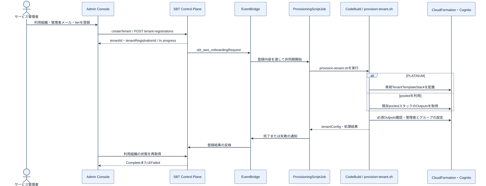
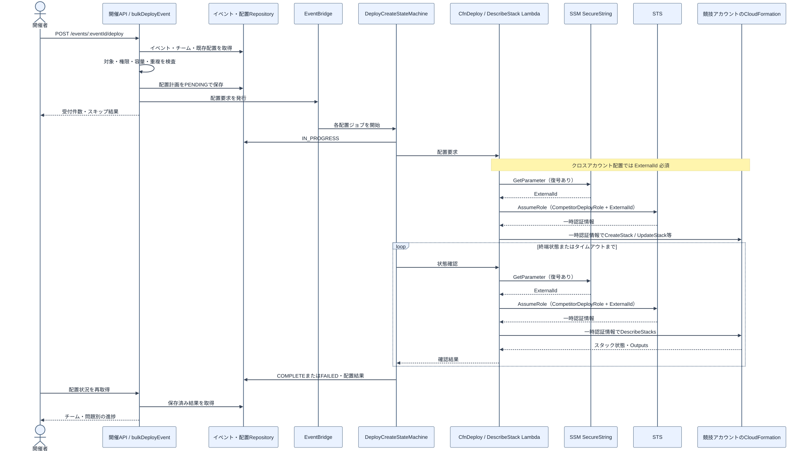
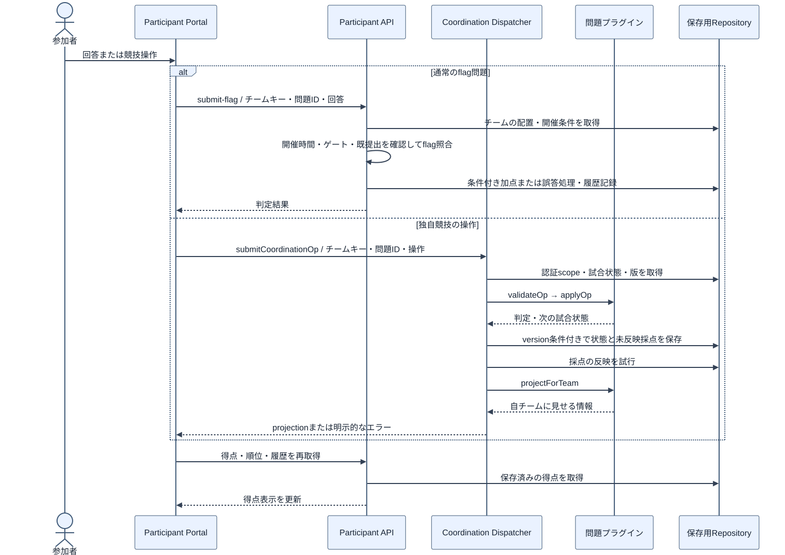
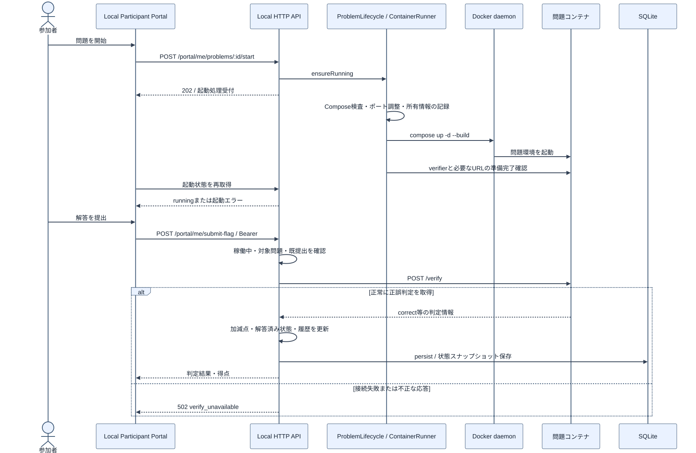

# アーキテクチャの読み方

TenkaCloud の開発者向けに、利用者・責務・実行担当・操作順を分けて説明します。
確認基準は `80dfebb145fc8df2fbe93f3259e5342f75d72da9` の実装です。
図はコードの構造を示し、実 AWS のリソース一覧や稼働実績を示すものではありません。

## 最初に読む順番

1. [既存 Draw.io 原本](diagrams/system-architecture.drawio)の **05 システムコンテキスト**で、利用者と外部システムを確認する。
2. 同原本の **04 ユースケース**で、開催者・参加者・開発者の操作を確認する。
3. [論理アーキテクチャ](#論理アーキテクチャ)で、責務を確認する。
4. [クラウドのコンポーネント](#クラウドのコンポーネント)または[ローカルのコンポーネント](#ローカルのコンポーネント)から、実装の担当へ進む。
5. 操作別のシーケンス図で、受付から完了までを追う。
6. 最後に Draw.io の **01 SaaS / 02 Lite / 03 Local** で、物理的な配置と配線を確認する。

| モード | 利用目的 | 実行経路 |
| --- | --- | --- |
| SaaS | 複数組織によるクラウド競技の開催 | SBT による組織管理、pooled / silo の開催アプリ、共通の問題配置・参加者処理 |
| Lite | 一つの開催環境でのクラウド競技 | SBT の組織管理を置かず、開催アプリと問題配置・参加者処理を使う |
| Local play | 手元での個人練習 | `make local`、固定の `eventId=local / teamId=local`、SQLite と Docker 問題 |

開発中の複数チーム向け `local-host` と、暗号バトル専用の開発ハーネスは、ここで説明する `make local` の経路に含めません。
`make local-dev` は Bun と Vite で動かす開発経路です。Docker 問題にも対応し、Simulator は明示的に有効化した場合だけ使います。

## 論理アーキテクチャ



利用組織の管理、開催管理、問題環境の管理、競技実行の責務です。箱の数は CDK スタックや AWS アカウントの数ではありません。
SaaS の pooled / silo は開催管理環境の配置方法の違いです。Lite に SBT の組織管理はありません。

根拠: [app-wiring/wire.ts](../../infrastructure/lib/app-wiring/wire.ts)。開催側へ共有バックエンドの Lambda 参照を渡すため、開催処理のすべてが TenantTemplateStack 内で動くわけではありません。

## クラウドのコンポーネント



開催 API、問題配置、参加者 API、独自競技プラグイン、定期採点は別の担当です。
参加者の通常のリクエストが、毎回 SBT の登録処理や問題配置の Step Functions を通るわけではありません。

- 開催・配置: [problem-deploy](../../infrastructure/lib/problem-deploy/)。`buildDeployPipeline()` が配置ワークフローを組み立てる。
- 参加者: `buildParticipantPortalSubsystem()` が参加者 API と Coordination Dispatcher を分離する。
- 定期採点: `buildScoringSubsystem()` が GenericScoring を配線し、独自競技の tick を Dispatcher へ委譲する。
- 保存: DynamoDB、または対応する Turso 構成。Turso の状態更新は StatusWriter Lambda を経由し、Step Functions が SQL に直接接続するわけではない。

Dispatcher の分離は、フェデレーション用の権限をプラグイン実行担当から外すためです。任意コードを安全に動かす sandbox ではなく、信頼するプラグインを前提にしています。
テナント分離はストレージやスタックだけに任せず、API の認証・scope 検証も必要です。

## ローカルのコンポーネント



既存 Draw.io の **03 Local** にある Docker 構成を、処理担当に絞った図です。
`tenkacloud-local` が Portal と API を配信し、問題コンテナを同じ Docker daemon 上の別コンテナとして起動します。制御用コンテナの内部に問題コンテナを起動する構成ではありません。

起動・停止は Docker ソケット、正誤照会は loopback HTTP の `/verify`、学習進捗の保存は SQLite です。
`local-data-permissions` が volume の所有者を調整した後、uid 1000 の制御用コンテナが起動します。

根拠: [compose.local.yaml](../../compose.local.yaml)、[docker-launcher.sh](../../scripts/local/docker-launcher.sh)、[server.ts](../../scripts/local-play/server.ts)、[container-runner.ts](../../scripts/local-play/container-runner.ts)。

Docker ソケットの `:ro` は、Docker API の作成・削除操作を読み取り専用にはしません。
`assertComposePolicy()` は起動・復旧時に Compose を検査しますが、独立した権限仲介サービスではありません。
問題コンテナへ Docker ソケットを渡さない境界を維持してください。

## テナント登録のシーケンス



対象は SaaS。管理画面からの登録受付と、テナントの利用準備完了は別です。
PLATINUM は専用スタックを配置し、それ以外は既存 pooled スタックの情報を使います。
CodeBuild を起動しただけでは Complete ではなく、SBT への結果通知まで確認します。

根拠: [tenants.ts](../../apps/admin-console/src/api/tenants.ts)、[provision-tenant.sh](../../scripts/provision-tenant.sh)。失敗時はライフサイクルジョブと CodeBuild の結果を確認します。

## 問題配置のシーケンス



対象は SaaS / Lite の AWS Lambda 配置経路です。
`bulkDeployEvent()` が対象・権限・容量・重複を確認し、配置計画を保存してから非同期処理へ渡します。
HTTP の受付件数は配置成功件数ではありません。チーム・問題別の COMPLETE / FAILED を確認します。

`useBulkDistributedMap` が有効なら S3 の計画から子実行を開始し、無効なら個別イベントを発行します。CodeBuild の配置経路は図から省略しています。

根拠: [bulk-deploy](../../infrastructure/lib/problem-deploy/handlers/event-handler/bulk-deploy/)、[deploy-create-state-machine.ts](../../infrastructure/lib/problem-deploy/deploy-create-state-machine.ts)。失敗時は配置レコード、Step Functions の履歴、対象スタックのイベントを確認します。

## クラウドでの回答と採点



通常の flag 提出と独自競技の操作は別の API です。参加者の所属は、提出本文の teamId を信用せずチームキーから解決します。
独自競技では `validateOp`、`applyOp`、`projectForTeam` を使い、チームに見せてよい情報だけを返します。

状態保存と得点反映は常に同時ではありません。`pendingScores` を保存し、`tryDeliverCoordinationScores()` で反映を試行します。
競合・版不整合・容量超過を成功扱いせず、応答と保存状態を確認します。定期採点の GenericScoring は、提出とは別の起動経路です。

根拠: [submit-flag.ts](../../infrastructure/lib/problem-deploy/handlers/participant-handler/submit-flag.ts)、[coordination-dispatcher-handler](../../infrastructure/lib/problem-deploy/handlers/coordination-dispatcher-handler/)。

## Local play の開始と採点



開始 API は 202 で受け付け、実 Docker の起動結果を後から取得します。正誤判定は問題コンテナの `/verify` に委譲し、基盤が加減点・解答済み状態・履歴を更新します。
HTTP サーバーは変更後に `persist()` を待ってから応答します。

起動失敗、停止中の提出、検証器への接続失敗は別の結果です。接続失敗を不正解に置き換えません。
既提出なら検証器を再度呼ばず、重複加点を避けます。

根拠: [api.ts](../../scripts/local-play/api.ts)、[api-scoring.ts](../../scripts/local-play/api-scoring.ts)、[server.ts](../../scripts/local-play/server.ts)。起動エラーは ContainerRunner と問題コンテナのログ、`verify_unavailable` は検証器の到達性を確認します。

## 図の更新

物理構成・コンテキスト・ユースケースの正本は [Draw.io](diagrams/system-architecture.drawio) です。
追加した責務・操作順の図は [Mermaid 原稿](diagrams/)を編集し、developer-portal の `public/docs/assets/architecture/` にある SVG を再生成します。
再生成は Mermaid CLI 11.17.0 を使用します。ブラウザ実行環境に合わせた Puppeteer 設定を指定してください。

```bash
docs/architecture/diagrams/render.sh
```

SVG はブラウザで開けるため、マニュアルを読むために図の編集ツールを起動する必要はありません。

クラウドでの請求や実開催の確認範囲は [running-costs.md](../running-costs.md)、個人練習の起動手順は [local-play.md](../local-play.md) を参照してください。
