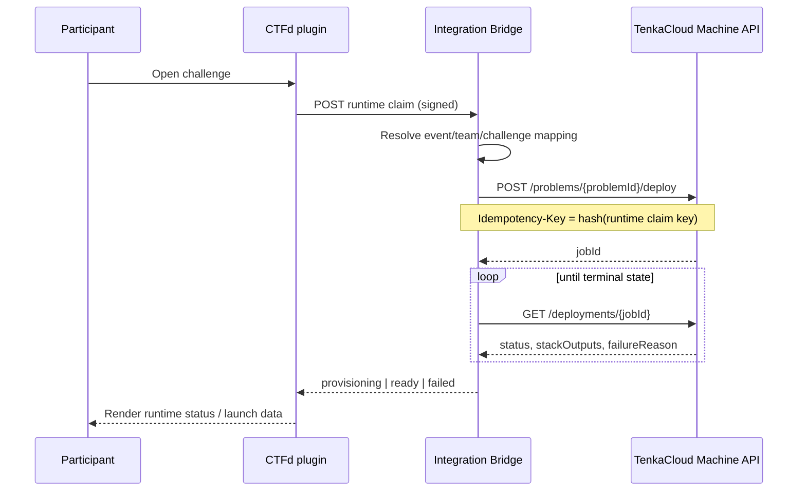

# ADR-0002: CTFd と TenkaCloud の runtime integration seam

- **Status**: Accepted (Phase 1 PoC の責務境界)
- **Date**: 2026-08-28
- **Deciders**: Susumu Tomita (`@susumutomita`)
- **Tracked by**: [Issue #3094](https://github.com/susumutomita/TenkaCloud/issues/3094)

## Context

TenkaCloud は問題環境の deploy、状態追跡、stack output、失敗理由を tenant 単位で管理する。
一方、CTFd は参加登録、team、challenge 表示、submission、scoreboard を管理する。両者を
「CTFd の plugin が TenkaCloud の内部 API を直接呼ぶ」だけで接続すると、次の境界が曖昧になる。

- team identity と AWS account の対応をどちらが正本にするか。
- CTFd の request retry が同じ問題環境を複数 deploy しないか。
- TenkaCloud の machine credential を CTFd plugin に配布してよいか。
- challenge の削除、event 終了、再試行時に誰が runtime を撤去するか。
- CTFd の score と TenkaCloud の scoring evidence が競合した場合にどちらを採用するか。

既存 Machine API は `TenantMachine` role と tenant binding scope を持つ client-credentials token
だけを受け付け、到達可能な route は
`infrastructure/lib/problem-deploy/handlers/shared/machine-scopes.ts` の
`MACHINE_ROUTE_SCOPES` が正本です。現在の surface は event/deployment の read、problem deploy、
failed deployment retry に限定される。team login key、管理者 route、event progression route は
machine principal から到達不能です。

## Decision

### 1. System of record

責務は次のように固定する。

| Domain | System of record | 境界 |
| --- | --- | --- |
| participant registration / team membership | CTFd | TenkaCloud は CTFd user credential を保持しない |
| challenge visibility / unlock / submission / scoreboard | CTFd | Phase 1 では CTFd が flag 判定と得点を持つ |
| cloud account assignment | Integration Bridge の operator-managed mapping | CTFd team id と `awsAccountId` の対応だけを保持する |
| problem catalog / runtime deploy / deployment state | TenkaCloud | CTFd は CloudFormation や Docker を直接操作しない |
| cloud resource teardown | TenkaCloud | CTFd event 削除だけでは resource を削除しない |
| audit evidence | 各 system | correlation id で突合し、一方の audit log を他方で上書きしない |

Phase 1 の CTFd は **competition control plane**、TenkaCloud は **runtime control plane** とする。
CTFd challenge id と TenkaCloud problem id は同一である必要はなく、明示 mapping を介する。

### 2. Integration component

CTFd plugin と TenkaCloud Machine API の間に小さな **Integration Bridge** を置く。
CTFd plugin が Cognito client secret を直接保持する構成は採用しない。

```text
Browser
  -> CTFd
      -> CTFd TenkaCloud plugin
          -> Integration Bridge
              -> Cognito client_credentials
              -> TenkaCloud Machine API
                  -> deploy pipeline
```

Bridge の責務は次の 5 点だけです。

1. CTFd からの署名済み request を認証する。
2. CTFd id を TenkaCloud id / AWS account に変換する。
3. idempotency key を生成し Machine API を呼ぶ。
4. deployment state を polling し、CTFd plugin 向けの最小 view に投影する。
5. correlation id と監査情報を保存する。

Bridge は challenge content、flag、team login key、AWS credential、CloudFormation template を
保持しない。CTFd browser セッションを TenkaCloud token に変換する token exchange も行わない。

### 3. Identity mapping

Bridge は次の複合 key を runtime claim の正本にする。

```text
<ctfdInstanceId>/<ctfdEventId>/<ctfdTeamId>/<ctfdChallengeId>/<generation>
```

mapping は operator が事前登録する。

| CTFd | TenkaCloud / Bridge | Rule |
| --- | --- | --- |
| `ctfdEventId` | `integrationEventId` | CTFd instance 内で一意 |
| `ctfdTeamId` | `teamName`, `awsAccountId`, optional `accountGroupId` | 1 team から同時に複数 account へ fan-out しない |
| `ctfdChallengeId` | `problemId`, optional `problemSetId`, `region` | mapping 無しは fail closed |
| `generation` | explicit integer | reset/recreate のときだけ operator が増やす |

CTFd の display name は変更可能なので identity key に使わない。TenkaCloud の `teamName` は
deploy request 用の内部 slug とし、Bridge が安定した値を生成する。

### 4. Authentication and authorization

- CTFd -> Bridge は HMAC 署名または private network 上の workload identity を使う。request は
  タイムスタンプ、nonce、body digest を含み、replay window を超えた request を拒否する。
- Bridge -> TenkaCloud は Cognito client credentials を使う。token は 15 分以内の短命 token とし、
  tenant binding scope を 1 つだけ持つ。
- Phase 1 の Bridge credential は `tenkacloud/ops.read` と
  `tenkacloud/ops.deploy` だけを持つ。retry を自動化する場合に限り、別 client に
  `tenkacloud/ops.write` を与える。
- client secret は Bridge の secret store にだけ置き、CTFd database、plugin configuration、
  browser、log、GitHub Issue に出さない。
- `TenantMachine` から到達不能な route を plugin 要件のために広げない。新しい operation が必要な
  場合は `MACHINE_ROUTE_SCOPES` と OpenAPI を同じ PR で更新する。

### 5. Minimal API flow

Phase 1 は既存 Machine API だけで runtime provisioning PoC を成立させる。



利用する既存 route は次のとおりです。

- `POST /problems/{problemId}/deploy`
- `GET /deployments/{jobId}`
- `GET /deployments/{jobId}/stack-progress` (operator troubleshooting のみ)
- `GET /problems/{problemId}/deployments` (reconciliation のみ)
- `POST /deployments/retry` (manual operator action のみ)

Bridge は runtime claim key から決定論的な `Idempotency-Key` を生成する。同じ generation の
retry は同じ key を使い、CTFd の HTTP retry で二重 deploy しない。

### 6. Score and result boundary

Phase 1 は CTFd の既存 flag/submission contract をそのまま使う。TenkaCloud は環境を provision
するが、CTFd scoreboard へ score を書かない。これにより、Machine API に未実装の score write
route を PoC のためだけに追加せずに済む。

TenkaCloud の uptime / attack / phased scoring を CTFd へ反映する Phase 2 では、次の read-only seam
を別 Issue で追加する。

- event/team/problem に束縛された immutable result projection。
- monotonically increasing revision または event id。
- CTFd plugin が同じ revision を二重加点しないための idempotency key。
- score の出所、計算 version、observed-at を含む evidence。

CTFd へ直接 score を push する webhook より、Bridge が read-only projection を pull する方式を
優先します。CTFd outage 中の retry と重複排除を Bridge 側で制御できるためです。

### 7. Teardown ownership

- Cloud resource の削除は TenkaCloud operation だけが実行する。CTFd plugin は AWS API を呼ばない。
- CTFd event/challenge/team の削除は runtime 削除を暗黙に起動しない。誤操作で競技環境を消さない
  ためである。
- event 終了時は operator が Bridge の reconciliation view で active deployment を確認し、
  TenkaCloud の承認済み teardown flow を実行する。
- teardown route を Machine API に追加する場合、deploy credential とは別 capability と client を
  用意し、dry-run inventory、explicit confirmation、audit log を必須にする。
- CTFd 側の mapping は runtime terminal state と TenkaCloud audit id を保存してから archive する。

### 8. Failure and reconciliation

Bridge の runtime claim state は次だけを持つ。

```text
requested -> deploying -> ready
                    \-> failed
ready -> teardown-requested -> removed
```

`failed` からの retry は operator action とし、自動無限 retry を禁止する。Bridge 起動時は保存した
`jobId` を `GET /deployments/{jobId}` で再照合する。CTFd の一時障害で callback が失われても、
TenkaCloud の deployment を新規作成せずに復旧する。

### 9. Phase 1 PoC scope

PoC は次を完了条件にする。

- CTFd の 1 event、2 teams、1 challenge を mapping できる。
- challenge open の retry を含め、team/challenge/generation 当たり deploy が 1 件だけ作られる。
- provisioning / ready / failed を CTFd challenge page に表示できる。
- Bridge credential に read/deploy 以外の capability が無い。
- CTFd delete 操作が TenkaCloud resource を削除しない。
- Bridge restart 後に既存 `jobId` から reconciliation できる。

PoC の scope 外は、TenkaCloud score の CTFd 反映、automatic teardown、multi-tenant Bridge、
participant credential federation、CTFd plugin marketplace 公開です。

## Consequences

- **Good**: CTFd の競技 UX を維持したまま、runtime provisioning と cloud audit を TenkaCloud に
  委譲できる。既存 Machine API の最小 capability だけで PoC を開始できる。
- **Good**: CTFd browser/セッションと TenkaCloud machine credential が分離される。
- **Bad**: Bridge という追加 component の運用が必要になる。mapping と reconciliation database を
  高可用にする責任が増える。
- **Tradeoff**: Phase 1 では score の正本を CTFd に限定するため、TenkaCloud Battle scoring の
  real-time 反映は行わない。score seam は evidence contract を決めてから追加する。

## References

- Issue #3094
- `docs/api/machine-api.openapi.json`
- `docs/operations/machine-credentials.md`
- `infrastructure/lib/problem-deploy/handlers/shared/machine-scopes.ts`
- `infrastructure/lib/problem-deploy/handlers/deploy-handler/list.ts`
