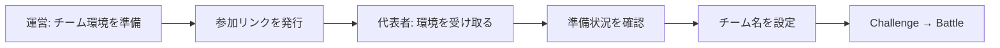

# 参加リンクからチーム環境を受け取る

[English](participant-self-registration.en.md) · [イベント運営](event-runbook.md)

参加者へのログインキーの個別配布を、期限付きの参加リンクへ置き換えます。代表者が 1 回申し込むと、運営が用意した未割り当てのチーム環境を 1 つ確保します。同じブラウザで再読み込みしても二重に割り当てません。

## 運営が先に用意するもの

1. 既存の手順で、イベント・参加チーム・チームごとの別々の AWS アカウントを登録する。競技者ロールの信頼関係、必須の ExternalId、アカウント検証を済ませる。
2. イベントに問題を追加し、対象チームへ一括デプロイする。受付はデプロイ中でも開けるが、全問題が準備できるまでログインキーを渡さない。Gate を使う場合も先に両方をデプロイする。
   DynamoDB の場合は下記の「受付容量」を確認してからリンクを配る。大人数ではデプロイ完了後に配り、準備待ちの同時更新を減らす。
3. 管理画面のイベント詳細 → **チーム** → **参加者が自分で環境を受け取る**を開く。配るチーム、受付期限を選び、環境を準備したことを確認して発行する。
4. 表示されたリンクを代表者へ配る。4 人チームなら申込みは代表者 1 人だけである。リンクを知る人は空き枠を確保できるため、一般公開せず参加予定者に渡す。
5. 終了後は受付を閉じ、通常のイベント終了・削除でリソースを片付ける。**受付を閉じても AWS リソースは削除されない。**

リンクの秘密部分は発行時だけ表示します。紛失・漏えい時は再発行してください。旧リンクからの新規申込みは止まり、割り当て済み代表者の受付票は使い続けられます。

## 参加者の操作

1. 参加リンクを開き、**チームの環境を受け取る**を押す。
2. 準備中はその画面で待つ。失敗と表示された場合は運営へ連絡する。再申込みで別枠を確保する必要はない。
3. 準備ができたら **この環境で始める**を押し、既存のチーム設定画面で名前を決める。以後の問題一覧、AWS 接続、Gate、採点は通常と同じである。

受付票はそのブラウザに保存します。シークレットウィンドウを閉じる・ブラウザデータを削除する・別端末へ移ると自動復帰できません。その場合は運営が受付設定のチーム枠にある「受付済み」の表示と代表者を確認し、チーム一覧から既存のチームログインキーを渡します。解放して再配布する操作は提供しません。

## 費用と対応範囲

- **AWS アカウントや Free Project の自動作成機能ではない。**用意済みの環境を割り当てる。AWS 側の無料制度の利用資格・サービス制限・発行操作は別途確認する。
- 既存の Participant API、イベント API、Events/Teams/Deployments 保存先を使用する。新しい DB、KMS キー、常駐サーバーは追加しない。既存サービスのリクエスト・データ転送・演習リソースには従来の費用がかかる。
- Lite/SaaS の AWS 環境で、DynamoDB と Turso に対応する。保存先を変更してもデータは自動移行しない。ローカルの疑似 AWS 環境を払い出すものではない。
- 1 リンクは最大 99 チームの明示した枠だけである。本人確認や「1 人 1 申込み」の保証はない。複数端末から別の受付票を作れば複数枠を取れるため、運営側で配布範囲を管理する。
- 受付済みチームが準備に失敗しても、別チームの資格情報を返さない。既存のデプロイ再試行を使い、同じ受付画面で再確認する。

## 受付容量：99枠と99件の一斉申込みは別

99 は保存できるチーム枠の上限です。**DynamoDB のデフォルト 1 RCU / 1 WCU で 99 件を一斉に処理できるという意味ではありません。**受付票は既存 Events 項目に保存するため、人数が増えると項目も大きくなります。部分更新でも項目全体に応じた書込み容量を使い、競合で条件付き更新が失敗した場合にも容量を消費します。[AWS の容量計算](https://docs.aws.amazon.com/amazondynamodb/latest/developerguide/read-write-operations.html)

1. 保存先を確認する。Turso には下記の DynamoDB 設定は不要ですが、契約プランの上限とリクエスト量を確認する。**保存先を切り替えても既存データは移行されません。**
2. DynamoDB は受付前に TenantAdmin へ依頼し、管理画面の **高度操作 → DynamoDB キャパシティ → キャパシティを変更 → 対象テーブル Events** または[既存の容量運用手順](dynamodb-event-capacity.md)で、一時的に Events と GSI を増強する。例として 99 枠を用意する開催では **200 RCU / 200 WCU** から見積もり、実際の項目サイズ・競合・同時利用イベントに合わせて確認する。これは上限 200 の手動設定で、自動では増えない。GSI が 1 本あるため、合算は 400 RCU / 400 WCU となり、追加費用が発生する。
3. 200 へ上げても 99 件同時成功を保証しない。準備完了を確認し、代表者へ少人数ずつ案内する。目安は毎秒 2 チーム以下から始める。例えばイベント項目全体が 32 KiB なら、2 件/秒の成功だけで 64 WCU、全件が 1 回競合再試行すると 128 WCU が必要になる。項目が大きい場合や他イベントの利用が重なる場合は案内を遅らせる。準備中の 5 秒間隔の確認は読込み容量も使う。
4. パネルの実容量・消費・Throttle を確認する。増強の完了前や、容量不足が解消していない状態で案内を続けない。受付票は保持されるため、エラー時は同じ画面から再試行する。バースト容量を前提にしない。
5. 受付停止後、同じ管理機能で **受付前に記録した容量へ戻す**。他イベントが利用中なら担当者と調整する。デプロイ設定が 1/1 でも、差分のない再デプロイでは一時増強は戻らない。

99 件の競合テストは SQLite による割当の整合性の検証です。DynamoDB の本番負荷試験ではありません。継続的な大規模一斉受付では Turso の利用、受付時間の分散、または受付票を独立項目へ分離する設計を検討してください。

## 開発時の確認

実 SQLite・本番用 API での並行申込み、同じ受付票の再試行、満員、期限、テナント分離、失敗後の再試行、資格情報を返す条件をテストしています。DynamoDB は条件付き更新と IAM の生成内容を検査しています。ブラウザでは申込み → 準備中 → 準備完了 → チーム設定まで確認しました。準備状態にはローカルの明示的な fixture を使い、実 AWS へのデプロイは行っていません。

実イベント前には、2 チームでリンクを開き、別々の環境になったこと、片方の準備失敗がもう片方へ影響しないこと、参加者権限と終了後の削除を確認してください。
