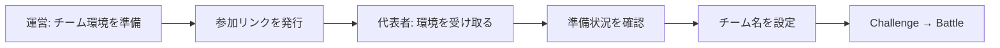

# 参加リンクからチーム環境を受け取る

[English](participant-self-registration.en.md) · [イベント運営](event-runbook.md)

参加者へのログインキーの個別配布を、期限付きの参加リンクへ置き換えます。代表者が 1 回申し込むと、運営が用意した未割り当てのチーム環境を 1 つ確保します。同じブラウザで再読み込みしても二重に割り当てません。

## 運営が先に用意するもの

1. 既存の手順で、イベント・参加チーム・チームごとの別々の AWS アカウントを登録する。競技者ロールの信頼関係、必須の ExternalId、アカウント検証を済ませる。
2. イベントに問題を追加し、対象チームへ一括デプロイする。受付はデプロイ中でも開けるが、全問題が準備できるまでログインキーを渡さない。Gate を使う場合も先に両方をデプロイする。
3. 管理画面のイベント詳細 → **チーム** → **参加者が自分で環境を受け取る**を開く。配るチーム、受付期限を選び、環境を準備したことを確認して発行する。
4. 表示されたリンクを代表者へ配る。4 人チームなら申込みは代表者 1 人だけである。リンクを知る人は空き枠を確保できるため、一般公開せず参加予定者に渡す。
5. 終了後は受付を閉じ、通常のイベント終了・削除でリソースを片付ける。**受付を閉じても AWS リソースは削除されない。**

リンクの秘密部分は発行時だけ表示します。紛失・漏えい時は再発行してください。旧リンクからの新規申込みは止まり、割り当て済み代表者の受付票は使い続けられます。

## 参加者の操作

1. 参加リンクを開き、**チームの環境を受け取る**を押す。
2. 準備中はその画面で待つ。失敗と表示された場合は運営へ連絡する。再申込みで別枠を確保する必要はない。
3. 準備ができたら **この環境で始める**を押し、既存のチーム設定画面で名前を決める。以後の問題一覧、AWS 接続、Gate、採点は通常と同じである。

受付票はそのブラウザに保存します。シークレットウィンドウを閉じる・ブラウザデータを削除する・別端末へ移ると自動復帰できません。その場合は運営が受付設定のチーム枠にある「受付済み」の表示と代表者を確認し、チーム一覧から既存のチームログインキーを渡します。解放して再配布する操作は提供しません。

## 費用と対応範囲

- **AWS アカウントや Free Project の自動作成機能ではない。**用意済みの環境を割り当てる。AWS 側の無料制度の利用資格・サービス制限・発行操作は別途確認する。
- 既存の Participant API、イベント API、Events/Teams/Deployments 保存先を使用する。新しい DB、KMS キー、常駐サーバーは追加しない。既存サービスのリクエスト・データ転送・演習リソースには従来の費用がかかる。
- Lite/SaaS の AWS 環境で、DynamoDB と Turso に対応する。保存先を変更してもデータは自動移行しない。ローカルの疑似 AWS 環境を払い出すものではない。
- 1 リンクは最大 99 チームの明示した枠だけである。本人確認や「1 人 1 申込み」の保証はない。複数端末から別の受付票を作れば複数枠を取れるため、運営側で配布範囲を管理する。
- 受付済みチームが準備に失敗しても、別チームの資格情報を返さない。既存のデプロイ再試行を使い、同じ受付画面で再確認する。

## 開発時の確認

実 SQLite・本番用 API での並行申込み、同じ受付票の再試行、満員、期限、テナント分離、失敗後の再試行、資格情報を返す条件をテストしています。DynamoDB は条件付き更新と IAM の生成内容を検査しています。ブラウザでは申込み → 準備中 → 準備完了 → チーム設定まで確認しました。準備状態にはローカルの明示的な fixture を使い、実 AWS へのデプロイは行っていません。

実イベント前には、2 チームでリンクを開き、別々の環境になったこと、片方の準備失敗がもう片方へ影響しないこと、参加者権限と終了後の削除を確認してください。
