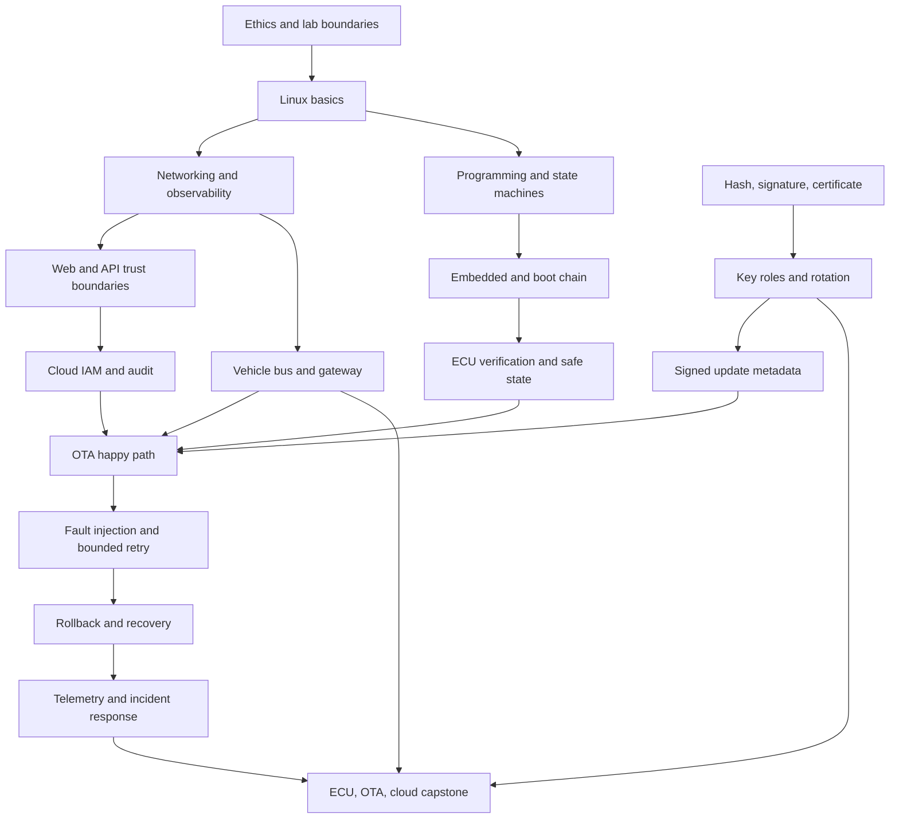

# セキュリティ教育コンテンツ調査と TenkaCloud カリキュラム原案

Issue #2603 の調査結果を、2026-07-13 時点の公式情報と実プレーに基づいて
整理する。候補の一覧だけでなく、学習目標、前提関係、演習、評価、
初学者支援を #2600 の仮想車両 MVP へ接続できる形にした。

- [共通の調査記録フォーマット](./record-template.md)
- [実プレー記録: Google Gruyere](./played/google-gruyere.md)
- [TenkaCloud 取り込み用の Issue draft](./follow-up-issues.md)

## 証拠の境界

公式ページを確認したことと、受講者として操作したことを区別する。
実際にプレーしたのは Google Gruyere の Reflected XSS 課題 1 件です。
ほかの候補は、公式の概要、カリキュラム、アクセス条件を比較した段階であり、
受講済みとは扱わない。

認証情報、受講証明書、個人情報、課題の完全な解答は保存しない。
有料コースの購入、大学への出願、外部アカウントの作成も行っていない。
料金、提供範囲、日程は変わるため、実際の登録前に再確認する。

## 調査方法

1. 大学・大学院、実践演習、競技・認定から候補を集めた。
2. 公式ページで対象者、構造、演習、評価、アクセス条件を確認した。
3. TenkaCloud との関連を、Web、cloud、低レイヤーの観点で比較した。
   組み込み、Blue Team、体系性も別の評価軸にした。
4. 認証と課金が不要な公開教材を、許可された範囲で実際にプレーした。
5. 観察結果を、ECU、OTA、クラウドの統合コースへ逆算した。

## 調査候補

公式情報の最終確認日は 2026-07-13 です。

| # | カテゴリ | コンテンツ | 教育設計とアクセス | TenkaCloud で見る観点 |
|---:|---|---|---|---|
| 1 | 大学院 | [Georgia Tech OMS Cybersecurity](https://pe.gatech.edu/degrees/cybersecurity) | 10 科目のオンライン修士。情報セキュリティ、Policy、Cyber-Physical Systems の 3 track。出願と学費が必要 | 分野横断の core と specialization、組み込み・制御の位置付け |
| 2 | 大学院 | [NYU Tandon Cybersecurity M.S.](https://engineering.nyu.edu/academics/programs/cybersecurity-ms-online) | 30 credit を core、breadth、depth に分けるオンライン修士。出願と学費が必要 | 暗号、Application、Network、Forensics を体系へ組み込む方法 |
| 3 | Web lab | [PortSwigger Web Security Academy](https://portswigger.net/web-security) | 公開教材と多数の interactive lab。教材は無料だが、今回の lab 起動は login へ遷移 | learning path、難易度 tier、現実的な短時間 lab、進捗管理 |
| 4 | Web codelab | [Google Gruyere](https://google-gruyere.appspot.com/) | 公開説明と一時インスタンス。外部アカウントと課金なしで開始できた | 説明、exploit、fix、段階 Hint の短い反復 |
| 5 | Web lab | [OWASP WebGoat](https://owasp.org/www-project-webgoat/) | 意図的に脆弱なアプリケーションを localhost の Docker などで実行 | 説明、実行、mitigation の 3 段階と、再現可能な self-hosting |
| 6 | Cyber range | [pwn.college](https://pwn.college/welcome/welcome) | 公開教材に browser terminal、VS Code、Linux GUI、challenge、flag を統合 | 低レイヤー基礎、環境払い出し、細かな mastery checkpoint |
| 7 | CTF | [picoCTF / CyLab Security Academy](https://www.picoctf.org/) | 初学者向け on-ramp と picoGym。現行 platform の利用には account 確認が必要 | 小さい challenge、category ごとの導入、楽しさと継続性 |
| 8 | Wargame | [OverTheWire](https://overthewire.org/wargames/) | 公開 SSH credential から開始し、Bandit から分野別 game へ進む | Linux の段階的前提、外部ツールを増やさない短い課題 |
| 9 | Blue Team | [CyberDefenders](https://cyberdefenders.org/blue-team-labs/) | browser で DFIR、Threat Hunting、Threat Intelligence などを扱う | 証拠分析、調査手順、攻撃後の説明と報告 |
| 10 | Cloud game | [AWS Cloud Quest](https://aws.amazon.com/training/digital/aws-cloud-quest/) | AWS Skill Builder の 3D city で業務課題を解く。Skill Builder account が必要で、free account は多くの immersive experience の一部へ限定 access、全体は Individual または Team subscription | IAM、network、resilience を業務シナリオへ結び付ける方法。受講前に対象 role の提供条件を再確認 |
| 11 | Cloud lab | [Google Cloud training](https://cloud.google.com/learn/training) | course、learning path、hands-on lab、skill badge。lab は一時 credential で実環境を使う | 一時環境、明確な lab 手順、最終 challenge lab、費用隔離 |
| 12 | Blue Team path | [Microsoft Learn for Security Engineers](https://learn.microsoft.com/en-us/training/career-paths/security-engineer) | 自習可能な learning path と module。進捗保存や一部演習の account 条件は開始前に確認 | role-based objective、知識 module と実務 task の接続 |
| 13 | 総合演習 | [TryHackMe Cyber Security 101](https://tryhackme.com/path/outline/cybersecurity101) | Linux、network、crypto、offense、defense を section と recap で積み上げる。account と premium 範囲の確認が必要 | 初学者導線、反復、offense と defense の共通基礎 |
| 14 | 低レイヤー | [OpenSecurityTraining2](https://gitlab.com/opensecuritytraining2) | 公開 lecture、slide、exercise を自己管理で学ぶ。中央の自動採点は限定的 | CPU、assembly、firmware、reverse engineering の深い前提 |

### 優先して受講する対象

| 優先 | 対象 | 選定理由 | 次の検証 |
|---|---|---|---|
| P0 | Google Gruyere | 認証と課金なしで、安全な一時環境、段階 Hint、exploit と fix の対を観察できる | Reflected XSS 1 件を実プレー済み。別の修正課題で回帰評価まで追う |
| P1 | pwn.college | browser 内の terminal と細かな flag が、TenkaCloud の払い出しと checkpoint に近い | account 条件を確認し、導入 module を受講して Hint と進捗の粒度を記録する |
| P1 | Google Cloud hands-on training | 一時 cloud credential と challenge lab が、IAM・鍵・監査の評価設計に近い | Security Engineer path から 1 lab を選び、費用と account 条件を確認して受講する |
| P1 | OpenSecurityTraining2 | ECU、boot、firmware へ進む前の低レイヤー知識を補える | introductory exercise を実行し、教材と自動評価の間に必要な補助を記録する |

大学院は体系性の比較には重要ですが、出願、学費、学期日程が必要です。
初回の実践検証には、すぐ始められる P0、P1 の公開演習を先行させる。

## 優先候補の比較

| 観点 | Gruyere | pwn.college | Google Cloud hands-on | OpenSecurityTraining2 |
|---|---|---|---|---|
| 学習単位 | 脆弱性ごとの説明と短い challenge | module、resource、challenge、flag | role path、course、guided lab、challenge lab | lecture、slide、code、exercise |
| 前提の示し方 | 冒頭で Web 基礎を列挙 | 導入 challenge から shell 操作を教える | path と lab ごとに level、goal を提示 | class ごとの説明に依存 |
| 難易度 | 段階 Hint と exploit/fix | challenge の積み上げと solve 数 | guided から challenge lab へ移る | 自習者が範囲を組み立てる |
| 自動評価 | 明示的な完了 gate は弱い | flag と進捗 | task completion と badge | class により異なり、中央 gate は弱い |
| 人手評価 | なし | 通常はなし | 通常はなし | なし |
| 運営依存 | 公開 codelab と一時 app | hosted dojo と account | cloud platform、account、quota | 公開資材とローカル環境 |
| TenkaCloud への転用 | exploit と fix の対、段階 Hint | 環境払い出し、細粒度 checkpoint | 一時 credential、実 cloud の確認 | ECU 前提の深い補助教材 |
| 注意点 | 古いブラウザー説明、成功表示不足 | flag 最適化へ偏る危険 | vendor と費用への依存 | 初学者導線と評価を別途作る必要 |

## 学習目標

修了時の統合能力を次のように定義する。

> ECU から OTA クラウドまでの構成と責任境界を説明し、脅威を洗い出し、
> 署名された更新の正常系、拒否、再試行、ロールバックを実装・検証する。

この能力を、観察可能な学習目標へ分解する。

| ID | 学習目標 | 最低限の証拠 |
|---|---|---|
| LO-00 | 演習の許可範囲、データ分類、禁止操作を説明する | 境界 quiz と操作 log |
| LO-01 | Linux process、file、network を調査する | 指定した状態を command と根拠付きで特定する |
| LO-02 | HTTP、API、service 間の trust boundary を追跡する | request、identity、authorization の経路図 |
| LO-03 | IAM、secret、signing key の所有者と最小権限を設計する | policy test と key responsibility matrix |
| LO-04 | hash、署名、証明書、version metadata の役割を区別する | 署名検証と改ざん拒否の test |
| LO-05 | bootloader、ECU、Gateway、TCU の責任を説明する | component ごとの入力、判断、永続状態、出力 |
| LO-06 | CAN または代替 bus の message と信頼境界を調べる | message trace と spoofing の影響分析 |
| LO-07 | OTA の対象選択、配信、検証、install、report を実装する | 正常系の end-to-end trace |
| LO-08 | 通信断、電力不足、順序違反、health failure から復旧する | bounded retry と rollback の再現 test |
| LO-09 | telemetry と監査 log から障害と攻撃を区別する | timeline、root cause、影響範囲 |
| LO-10 | OEM、supplier、cloud operator、SOC の責任境界を説明する | RACI と受入 test の対応表 |
| LO-11 | 鍵失効、certificate 更新、supplier 撤退を含む長期運用を設計する | 移行と recovery を含む design review |

## スキルマップ

到達度は、説明、実行、診断、設計の 4 段階で扱う。

| 領域 | 説明 | 実行 | 診断 | 設計 |
|---|---|---|---|---|
| Linux・network | process と protocol を説明 | log と packet を取得 | 通信断を切り分け | 観測可能な構成を設計 |
| Web・API | identity と request flow を説明 | API を安全に呼ぶ | authorization failure を特定 | trust boundary と rate limit を設計 |
| Cloud・IAM | principal、role、policy を説明 | 一時 credential で操作 | deny と過剰権限を特定 | least-privilege policy を設計 |
| 暗号・鍵 | hash、署名、証明書を区別 | package を署名・検証 | 改ざん、期限、version failure を特定 | key role、rotation、revocation を設計 |
| ECU・boot | boot chain と update slot を説明 | image を install | boot failure を特定 | safe state と recovery path を設計 |
| 車載通信 | ECU、Gateway、bus を説明 | message を送受信 | spoof、drop、order failure を特定 | segmentation と allowlist を設計 |
| OTA | campaign と対象条件を説明 | 正常更新を完走 | retry、rollback を追跡 | dependency と rollout policy を設計 |
| Telemetry・IR | event と audit の違いを説明 | trace を収集 | root cause と影響範囲を特定 | retention、alert、handoff を設計 |
| Governance | 役割と承認を説明 | runbook に従う | 責任の空白を特定 | supplier 変更を含む受入基準を設計 |

## 前提知識グラフ

## 演習パターン集

| Pattern | 流れ | 自動評価 | 人手評価 |
|---|---|---|---|
| Observe, predict, act, explain | 初期状態を観察し、結果を予測して操作し、差分を説明する | state と event の差分 | 予測と実結果の因果説明 |
| Exploit and fix | 許可された弱点を再現し、修正し、回帰 test を通す | 攻撃成立、修正後拒否、正常系維持 | 修正の範囲と残余 risk |
| Fault and recover | 通信断、電力不足、health failure を注入して復旧する | retry 上限、state transition、rollback | safe state と判断理由 |
| Progressive checkpoint | 1 演習を 4 から 6 個の独立 checkpoint に分ける | checkpoint ごとの部分点 | 全体設計の一貫性 |
| Multiple valid designs | 複数の安全な構成を許容する | invariant と negative test | trade-off、cost、運用性 |
| Trace comparison | 正常、障害、攻撃の trace を比較する | 必須 event と順序 | root cause と不確実性 |
| Role handoff | OEM、supplier、SOC の間で証拠を引き継ぐ | artifact の存在と schema | 情報の十分性、責任境界 |
| Integration capstone | 曖昧な要求から脅威、実装、検証、説明まで行う | deploy と security invariant | architecture review と受入説明 |

Gruyere からは、説明、短い課題、段階 Hint、fix の順序を採用する。
TenkaCloud では、成功表示、attempt telemetry、修正後の回帰 test、
説明 rubric を追加し、単なる flag 取得を終点にしない。

## 自動採点と人手評価の境界

### 自動採点する項目

- metadata、package hash、signature、version、target ECU の機械的整合性
- unsigned、改ざん、期限切れ、downgrade、replay package の拒否
- ECU dependency、install 順序、retry 上限、timeout、rollback 完了
- health check 後の active slot と既知の正常 version
- IAM policy、resource scope、credential lifetime の静的 invariant
- telemetry の必須 event、correlation ID、actor、タイムスタンプ、result
- 同じ seed から同じ状態を再現できること
- checkpoint、Hint 利用、再試行回数、経過時間

### 人が評価する項目

- threat model の網羅性と、除外した risk の説明
- ECU、TCU、Gateway、cloud、supplier の責任境界
- 複数の安全な案から選んだ理由と trade-off
- 障害と攻撃を区別するために足りない証拠の認識
- 長期保守、鍵失効、supplier 撤退、cloud 移行の計画
- 非技術者へ事故の影響と次の判断を説明する能力

### 複合評価する項目

自動 test で最低限の安全性を gate した後、設計説明を 0 から 3 の rubric で
評価する。人手評価は結論の一致ではなく、証拠、前提、trade-off、
再現可能な検証を採点する。高リスクな最終課題は 2 名の reviewer が独立に
評価し、差が 2 段階以上なら根拠を再確認する。

## 良い設計と採用しない設計

| 採用する設計 | 採用しない設計 |
|---|---|
| 学習目標から checkpoint と rubric を逆算する | コンテンツ数や動画時間を達成指標にする |
| 短い説明の直後に同じ概念を操作する | 長い講義を終えてから初めて環境へ触る |
| Hint を観察、診断、原則の順で段階公開する | 失敗直後に完全な解答を表示する |
| exploit、fix、回帰 test を 1 単位にする | 攻撃成功だけで満点にする |
| 正常、障害、攻撃の trace を比較する | happy path だけを確認する |
| 部分点と再提出を許し、成長を記録する | 最初の失敗だけで不合格にする |
| 機械的 invariant と説明 rubric を分離する | 主観的な総合点だけで評価する |
| 外部教材の出典と確認日を保存する | 教材本文や解答を複製する |

## 初学者の詰まりポイント

| 詰まり | 観測・予想される症状 | TenkaCloud の対策 |
|---|---|---|
| 環境と教材の行き来 | どの URL や terminal を操作するか迷う | 1 画面に target、guide、state、reset を固定表示 |
| 前提 command の不足 | tool error を概念の失敗と誤認する | readiness check と最小 command primer |
| 成功条件が不明 | 正しい結果でも次へ進めない | checkpoint の観測対象と理由を表示 |
| URL encoding と escaping の混同 | 同じ文字の表現を無差別に試す | data flow と context を可視化 |
| IAM deny の情報不足 | credential、policy、resource を混同する | principal と decision log を並べる |
| 署名と暗号化の混同 | 秘密性があれば真正性もあると考える | hash、signature、encryption を別 checkpoint にする |
| retry と無限再実行の混同 | 障害時に状態を悪化させる | bounded retry と idempotency を trace で示す |
| rollback の目的誤認 | 古い version へ戻れば常に安全と考える | known-good、anti-rollback、safe state を区別 |
| Hint の過不足 | 早すぎる解答か、長時間の停滞になる | attempt と時間に応じた段階 Hint |
| cloud 費用への不安 | 操作を避けて学習が止まる | quota、TTL、cost upper bound を開始前に表示 |

## ECU・OTA・クラウド統合コース原案

基準線として、[Uptane Standard](https://uptane.org/docs/latest/standard/uptane-standard)、
[NIST SP 800-193](https://csrc.nist.gov/pubs/sp/800/193/final)、
[UN Regulation No. 156](https://unece.org/transport/documents/2021/03/standards/un-regulation-no-156-software-update-and-software-update)
を参照する。MVP は教育用の簡略化であり、Uptane 適合や法規適合を主張しない。

NIST の protect、detect、recover を全 module に通し、Uptane の update metadata、
repository、Primary ECU、Secondary ECU の責務を縮小モデルへ反映する。
UN R156 の software version、互換性、失敗時の復旧、十分な電力、安全な実行、
利用者への通知を、受入 test の観点として扱う。

| Module | 目標 | 主な演習 | 評価 | 目安 |
|---|---|---|---|---:|
| 0. Safety and evidence | 許可範囲と証拠の扱いを説明 | lab boundary と data classification | quiz と操作 log | 1h |
| 1. Linux and network | process、file、packet を追跡 | 壊れた service と通信を診断 | state checkpoint | 3h |
| 2. Web and API trust | identity と authorization を追跡 | API の越権を再現、修正 | exploit/fix test | 3h |
| 3. IAM, keys, signatures | key role と最小権限を設計 | package 署名、改ざん、期限、失効 | policy と verifier | 4h |
| 4. ECU and boot chain | boot、slot、known-good を説明 | 2 slot の install と boot 判定 | state transition | 5h |
| 5. Vehicle bus and gateway | ECU 間の信頼境界を説明 | message drop、spoof、順序違反 | trace と allowlist | 4h |
| 6. OTA happy path | campaign から report まで実装 | 1 TCU、2 ECU の signed update | end-to-end checkpoint | 4h |
| 7. Failure and rollback | bounded retry と safe recovery を実装 | 通信断、電力不足、health failure | negative test と rollback | 5h |
| 8. Telemetry and incident response | 障害と攻撃を証拠から区別 | timeline、containment、修正版配信 | event gate と report rubric | 4h |
| 9. Integration capstone | 責任境界を説明し安全な更新を検証 | 曖昧な要求から設計、実装、演習 | 自動 gate と 2 人 review | 8h |

各 module は、準備、観察、予測、実行、説明、修正、再検証の順にする。
module 6 以降は同じ仮想車両を使い、知識を別々の lab へ閉じ込めない。

## #2600 MVP 演習への反映案

最初の演習名を `secure-ota-rollback` とし、1 TCU、2 ECU、仮想 bus、
OTA service、署名 service の最小構成にする。最初は local Docker runtime を使い、
実機、AWS account、車載専用 hardware を必須にしない。

### 学習者へ渡す初期状態

- ECU A は署名を確認するが、version と health failure の扱いに不備がある。
- ECU B は ECU A より後に更新する dependency を持つ。
- TCU は bounded retry をせず、重複 command を発行する。
- cloud は campaign、package、vehicle inventory、audit event を保持する。
- 正常な package と、改ざん、downgrade、互換性不一致の fixture を用意する。

### checkpoint

`runtime.provider=docker` と `scoring.kind=multi-verify` を使う場合、次の 5 項目を
独立 checkpoint にする。

1. 署名された互換 package が ECU A、ECU B の順で install される。
2. unsigned、改ざん、downgrade package が state を変えず拒否される。
3. 通信断後に同じ campaign が重複 install されず再開する。
4. health failure 後に known-good slot へ rollback する。
5. すべての判断が同じ correlation ID で audit trace へ残る。

自動 checkpoint の後に、OEM、ECU supplier、OTA operator、SOC の RACI、
threat model、残余 risk を短い report で説明させる。report は自動 score と
分離し、人手 rubric を使う。

### Problem metadata と教育 graph

Issue #2604 で導入された `nodes` と `relations` を使い、次を宣言する。

- learning objectives: signed install、rejection、rollback、audit explanation
- concepts: signature、version metadata、idempotency、safe state、audit trail
- assessment criteria: unauthorized package rejection、bounded recovery、trace completeness
- misconceptions: encryption implies authenticity、rollback is always safe
- audiences: OEM architect、ECU supplier、OTA operator、SOC analyst
- relations: teaches、covers、requires、assesses、related_to

前提となる Linux、network、signature の問題を `requires` で接続する。
catalog validator の dangling reference と cycle 検査を利用し、学習順序を
文書だけに閉じ込めない。

### #2600 へ追記する受入条件

- 5 checkpoint が正常、改ざん、通信断、health failure を再現する。
- Hint は観察、診断、設計原則の 3 段階であり、解答を直接示さない。
- reset は idempotent で、10 分以内に既知の初期状態へ戻る。
- local 実行の CPU、memory、disk、所要時間に上限を置く。
- audit trace から学習者と reviewer が同じ timeline を再構成できる。
- README.ja.md と README.md に、はじめに、最初の一手、ゴールを記載する。
- 教育 graph、multi-verify、日英 parity を catalog validation で確認する。
- 実機と production cloud を使わずに、ブラウザーから主要 flow を完走できる。

## 外部依存とリスク

- 大学、認定、hosted lab は出願、account、料金、日程、地域制限がある。
- course、料金、URL、platform の仕様は変わるため、受講日と version を記録する。
- 有料教材の課題、解答、画像を複製せず、教育 pattern と観察だけを要約する。
- hosted lab の停止を考慮し、採用 pattern は self-hosted fixture で再現する。
- cloud lab は quota、TTL、費用上限、credential scope を開始前に確認する。
- 1 件の実プレーだけでは一般化できない。P1 の 3 系統を受講して比較を更新する。
- AI や公開 syllabus から、実際の初学者体験を推測して完了扱いにしない。
- 教授や TA の役割を削除するのではなく、rubric、複数 reviewer、handoff へ分解する。

## Issue #2603 完了条件との対応

- [x] 調査対象候補を 10 件以上リストアップした。14 件を比較した。
- [x] 優先対象を 3 件以上選定した。P0、P1 の 4 件を選定した。
- [x] 共通の記録フォーマットを確定した。
- [x] 1 件以上を実際にプレーした。
- [x] 実プレーを共通フォーマットで分析した。
- [x] 学習目標と演習構造を抽出した。
- [x] 良い設計と採用しない設計を整理した。
- [x] 自動採点と人手評価の境界を整理した。
- [x] TenkaCloud への取り込み Issue draft を作成した。PR 作成前に発番する。
- [x] ECU、OTA、cloud 統合コースの初期案を作成した。
- [x] #2600 の MVP へ、初期状態、checkpoint、教育 graph、受入条件を反映した。

外部 Issue の発番は root agent が PR 作成前に行い、この調査 PR で #2603 と
同時に閉じる。#2600 の code と problem 実装は同 Issue の後続作業であり、
調査資料だけを追加する本 PR には混ぜない。
